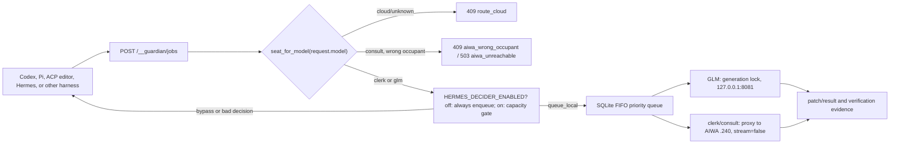

# Hermes-decided Qwen queue

`llama-guardian` owns Qwen's lifecycle and one-at-a-time queue. With
`FLEET_ROUTER=true` the GPU seat comes from `request.model` via the code
table (`seat_for_model`) — Hermes no longer picks the GPU. `HERMES_DECIDER_ENABLED`
defaults to `false`: with it off, clerk and GLM jobs with a local seat always
enqueue (wait your turn) and Hermes is not called. When enabled, Hermes acts
as a capacity gate only — it may return `queue_local` (wait) or `bypass`
(reject). It must not `fallback_cloud` a clerk or GLM seat; a violation (or a
timed-out/failed decision) fails closed with `503 hermes_decision_unavailable`.
The queue never chooses or invokes a cloud fallback; a cloud/unknown model is
rejected with `409 route_cloud` and never enqueued.



## Safety boundaries

- Queue endpoints accept loopback requests only by default. Remote queueing
  requires `GUARDIAN_QUEUE_ALLOW_REMOTE=true` and a bearer token.
- Each job is durable in `logs/guardian-queue.sqlite3`, idempotent, and is
  requeued after a guardian restart if it had not reached a terminal state.
- Qwen receives a completion request and returns a proposed patch/result. It
  does not receive unrestricted filesystem tools. The calling harness retains
  its existing approval and write gate.
- The guardian's generation lock serializes queued jobs and normal proxied
  generation requests. Port `8081` remains internal; clients must not bypass
  the guardian with direct requests. Clerk/consult queued jobs proxy to AIWA
  (`stream=false`) without taking `generation_lock`, `active_requests`, or
  waking GLM.

## Hermes contract

Guardian invokes the installed `hermes` executable in one-shot mode with task
metadata only: summary, expected line/file count, risk, source, and queue
snapshot. Hermes must return exactly:

```json
{"route":"queue_local","reason":"bounded implementation","priority":50}
```

Allowed routes for local seats are `queue_local` and `bypass` (`queue_qwen`
is a legacy alias for `queue_local`); priority is an integer from 0 through
100. `fallback_cloud` on a local seat is a policy violation and fails closed.
Invalid, timed-out, or failed Hermes decisions reject the submission rather
than silently routing code work somewhere else.

Optional environment overrides belong to the guardian's PM2 environment:

```text
HERMES_DECIDER_ENABLED=false
HERMES_DECIDER_EXE=hermes
HERMES_DECIDER_PROVIDER=
HERMES_DECIDER_MODEL=
HERMES_DECIDER_TIMEOUT_S=60
GUARDIAN_QUEUE_DB=C:\Workspace\Infrastructure\llama-cpp-server\logs\guardian-queue.sqlite3
GUARDIAN_QUEUE_ALLOW_REMOTE=false
GUARDIAN_QUEUE_TOKEN=
```

An empty provider/model uses Hermes's active configuration. Do not put tokens
in this repository or in the command line.

## Submit and poll

For a manual smoke test, submit a bounded request and wait for its result:

```powershell
.\scripts\qwen-submit.ps1 -Task "Add a function that returns the larger of two integers, with one unit test." -Source "codex-smoke" -ExpectedLines 20 -ExpectedFiles 2 -Wait
```

Every harness should use this protocol for a non-trivial code-execution task:

1. Submit a short decision context and a non-streaming OpenAI-compatible
   completion request to `POST /__guardian/jobs`.
2. If the response contains `job_id`, poll `GET /__guardian/jobs/{job_id}`.
3. Apply the returned patch only through the harness's normal approval gate.
4. If Hermes returns `bypass` (or fails), let that harness retain or
   select its own execution route. Do not post directly to `:8081`.

Queued work may be cancelled before it begins with
`POST /__guardian/jobs/{job_id}/cancel`.

The restored `scripts/acp-qwen-agent` uses this protocol in diff-only mode:
it does not expose model tools, direct `:8081` access, or automatic writes.
