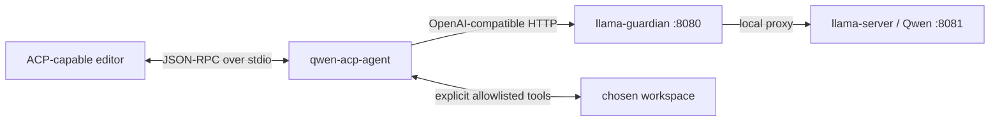

# Build Plan: ACP Wrapper for Local Qwen / llama.cpp

**Feature:** `acp-qwen-agent` — local ACP agent over stdio → llama-guardian `:8080`  
**Working branch:** `codex/qwen3-tuning-guardian-fix`  
**Wrapper root:** `scripts/acp-qwen-agent/`  
**Executor:** local Qwen via session handoff prompts (this file is the source of truth)

---

## Hard Constraints (executor must not violate)

1. **Do not modify** `ecosystem.config.cjs`, `scripts/llama-guardian.py`, PM2 process state, model/GPU/context/port settings.
2. **Do not restart, stop, or start** any PM2 / llama processes as part of this build.
3. All new code lives under `scripts/acp-qwen-agent/` only.
4. ACP protocol traffic only on **stdout**; diagnostics only on **stderr** (`console.error`).
5. Writes require **both** `ACP_ALLOW_WRITES=true` **and** an editor approval tied to the exact diff hash. Default is read-only.
6. No arbitrary shell tool, no network tools, no git mutators in v1.
7. Copy code blocks from this plan **verbatim**. Do not “improve” them.

---

## Codebase Primer (read fully before Session 1)

### What this repo is

`C:\Workspace\Infrastructure\llama-cpp-server` runs a local Qwen GGUF via `llama-server` behind **llama-guardian** (PM2). The guardian exposes an OpenAI-compatible API on **`http://127.0.0.1:8080/v1`**. The model server itself is on `:8081` and must not be called directly by this agent.

### What we are building

A small Node/TypeScript **ACP agent** that:

1. An ACP-capable editor launches as a **subprocess**.
2. Speaks **ACP JSON-RPC over stdio** (official `@agentclientprotocol/sdk`).
3. Calls Qwen through the guardian at `:8080/v1`.
4. Exposes a **tiny allowlisted tool surface** over a user-selected workspace.

Qwen stays an inference server. The wrapper owns the agent loop, ACP, tools, and safety policy.

### Architecture



### Target layout (end state)

```text
scripts/acp-qwen-agent/
  package.json
  package-lock.json
  tsconfig.json
  vitest.config.ts
  .gitignore
  .env.example
  README.md
  src/
    index.ts          # entry: CLI flags + ACP connect
    config.ts         # Zod env validation
    logger.ts         # stderr-only logging (no secrets/prompts by default)
    qwen/
      client.ts       # OpenAI-compatible client to :8080
      health.ts       # --health / --smoke helpers
    acp/
      agent.ts        # ACP handlers (initialize, session, prompt, cancel)
      session.ts      # session state
    tools/
      types.ts
      registry.ts
      list_files.ts
      read_file.ts
      search_text.ts
      propose_patch.ts
      apply_patch.ts
      path_guard.ts
    agent/
      loop.ts         # bounded model↔tool turn machine
      audit.ts        # metadata-only audit events
  test/
    config.test.ts
    path_guard.test.ts
    acp_init.test.ts
    tools_safety.test.ts
    fixtures/
      initialize_session_prompt.jsonl
```

### ACP SDK contract (verified against official example, 2026)

Use the modern builder API (not deprecated `AgentSideConnection` constructor):

```ts
import * as acp from "@agentclientprotocol/sdk";
import { Readable, Writable } from "node:stream";

const input = Writable.toWeb(process.stdout);
const output = Readable.toWeb(process.stdin) as ReadableStream<Uint8Array>;
const stream = acp.ndJsonStream(input, output);

acp
  .agent({ name: "qwen-acp-agent" })
  .onRequest("initialize", (ctx) => /* InitializeResponse */)
  .onRequest("session/new", (ctx) => /* NewSessionResponse */)
  .onRequest("authenticate", (ctx) => ({}))
  .onRequest("session/set_mode", (ctx) => ({}))
  .onRequest("session/prompt", (ctx) => /* PromptResponse using ctx.client */)
  .onNotification("session/cancel", (ctx) => /* void */)
  .connect(stream);
```

- `initialize` returns `{ protocolVersion: acp.PROTOCOL_VERSION, agentCapabilities: { loadSession: false }, ... }`.
- Prompt responses return `{ stopReason: "end_turn" | "cancelled" | ... }`.
- Stream agent text via `ctx.client.notify(acp.methods.client.session.update, { sessionId, update: { sessionUpdate: "agent_message_chunk", content: { type: "text", text } } })`.
- Write permission uses `ctx.client.request(acp.methods.client.session.requestPermission, ...)`.

### Environment variables (wrapper only)

| Variable | Default | Notes |
|---|---|---|
| `ACP_QWEN_BASE_URL` | `http://127.0.0.1:8080/v1` | Not a secret |
| `ACP_QWEN_MODEL` | `qwen3.6-35b` | Must match GET `/v1/models` id exactly |
| `ACP_WORKSPACE` | (required for tools/smoke) | Absolute path |
| `ACP_QWEN_TIMEOUT_MS` | `120000` | Finite timeout |
| `ACP_ALLOW_WRITES` | `false` | Hard gate |

Do **not** reuse unrelated app `.env` files. Real `.env` is gitignored under the wrapper folder.

### Success criteria (whole project)

1. `npm run check` and `npm test` pass in the wrapper folder.
2. Terminal smoke reaches Qwen via `:8080`.
3. ACP client can initialize and receive capability metadata.
4. Simple prompt → read-only file inspection + clear response.
5. Write path → proposed diff + explicit approval before any write.
6. Every tool action structured/logged without storing prompts/secrets by default.

---

## Session Map

| Session | Tasks | Focus |
|---|---|---|
| **1** | 1–3 | Baseline + scaffold + typed config + health CLI (no ACP loop yet) |
| **2** | 4–5 | Qwen client + ACP initialize/session/prompt (echo/model text, no tools) |
| **3** | 6–8 | Path guard + read-only tools + wire into agent loop |
| **4** | 9–11 | propose/apply patch gates + audit + reliability limits |
| **5** | 12–13 | Full tests, smoke, README, final verification |

**Orchestrator rule:** After each session, verify files/diff/tests before issuing the next session prompt. Do not let the executor advance early.

---

# Session 1 — Tasks 1–3

**Goal:** Create `scripts/acp-qwen-agent` as a typed Node package that validates config, can probe the guardian with `--health`, and has a stdio-safe entrypoint stub (no model chat loop yet).

---

## Task 1: Establish baseline (read-only)

### Steps

1. Run these PowerShell commands from the repo root. **Do not** restart PM2 or change guardian/server settings.

```powershell
Set-Location C:\Workspace\Infrastructure\llama-cpp-server
Get-Location
Get-Command node, npm, git
node -v
npm -v
git status --short
```

**Expected:**
- Location is `C:\Workspace\Infrastructure\llama-cpp-server`
- `node`, `npm`, `git` resolve
- Node is v20+ preferred (v18+ acceptable)
- `git status` may show `PLAN.md` / `plan.md` and other untracked files; that is fine

2. Probe the guardian (this may cold-start the model; that is OK):

```powershell
Invoke-RestMethod http://127.0.0.1:8080/v1/models
```

**Expected:** JSON object with a `data` array containing a model whose `id` is usable as `ACP_QWEN_MODEL`. Prefer the id that appears in the response (often `qwen3.6-35b`). Record the exact `id` string.

**Stop conditions:**
- If the request times out or fails: **STOP**. Report the full error. Inspect only with non-mutating diagnostics if needed (e.g. read logs). Do **not** run `pm2 restart/stop/start` or kill processes.
- If it succeeds: continue to Task 2.

3. Confirm the scaffold folder does not exist yet:

```powershell
Test-Path scripts\acp-qwen-agent
```

**Expected:** `False`. If `True`, STOP and report — do not overwrite without orchestrator guidance.

### Commit

No commit for Task 1.

---

## Task 2: Scaffold package files (full file contents)

### Steps

1. Create the directory:

```powershell
New-Item -ItemType Directory -Force -Path scripts\acp-qwen-agent\src, scripts\acp-qwen-agent\test | Out-Null
Set-Location scripts\acp-qwen-agent
```

2. Write **`package.json`** exactly:

```json
{
  "name": "acp-qwen-agent",
  "version": "0.1.0",
  "private": true,
  "description": "Local ACP agent wrapping Qwen via llama-guardian (OpenAI-compatible :8080)",
  "type": "module",
  "main": "dist/index.js",
  "bin": {
    "acp-qwen-agent": "./dist/index.js"
  },
  "scripts": {
    "dev": "tsx src/index.ts",
    "build": "tsc -p tsconfig.json",
    "start": "node dist/index.js",
    "check": "tsc -p tsconfig.json --noEmit",
    "test": "vitest run",
    "test:watch": "vitest"
  },
  "engines": {
    "node": ">=18"
  }
}
```

3. Write **`tsconfig.json`** exactly:

```json
{
  "compilerOptions": {
    "target": "ES2022",
    "module": "NodeNext",
    "moduleResolution": "NodeNext",
    "lib": ["ES2022"],
    "outDir": "dist",
    "rootDir": "src",
    "strict": true,
    "esModuleInterop": true,
    "skipLibCheck": true,
    "forceConsistentCasingInFileNames": true,
    "declaration": true,
    "sourceMap": true,
    "resolveJsonModule": true,
    "types": ["node"]
  },
  "include": ["src/**/*.ts"],
  "exclude": ["dist", "node_modules", "test"]
}
```

4. Write **`vitest.config.ts`** exactly:

```ts
import { defineConfig } from "vitest/config";

export default defineConfig({
  test: {
    environment: "node",
    include: ["test/**/*.test.ts"],
  },
});
```

5. Write **`.gitignore`** exactly:

```gitignore
node_modules/
dist/
.env
*.log
coverage/
.DS_Store
```

6. Write **`.env.example`** exactly:

```dotenv
# Copy to .env for local runs. Do not commit .env.
ACP_QWEN_BASE_URL=http://127.0.0.1:8080/v1
ACP_QWEN_MODEL=qwen3.6-35b
ACP_WORKSPACE=C:\Temp\acp-qwen-smoke
ACP_QWEN_TIMEOUT_MS=120000
ACP_ALLOW_WRITES=false
```

7. Write **`README.md`** exactly:

```markdown
# acp-qwen-agent

Local ACP agent that an editor launches over stdio. It talks to the local Qwen model through llama-guardian at `http://127.0.0.1:8080/v1`.

## Requirements

- Node.js 18+
- llama-guardian reachable on port 8080 (do not call llama-server :8081 directly)

## Setup

```powershell
Set-Location C:\Workspace\Infrastructure\llama-cpp-server\scripts\acp-qwen-agent
npm ci
copy .env.example .env
# edit .env: set ACP_WORKSPACE to an absolute disposable path
npm run check
npm test
npm run build
```

## CLI

```powershell
# Validate env + list models through guardian
npm run build
$env:ACP_QWEN_BASE_URL = 'http://127.0.0.1:8080/v1'
$env:ACP_QWEN_MODEL = 'qwen3.6-35b'
npm run start -- --health

# Later sessions add: npm run start -- --smoke
# Default (no flags): ACP JSON-RPC on stdio (editor launches this)
```

## Environment

| Variable | Default | Purpose |
|---|---|---|
| `ACP_QWEN_BASE_URL` | `http://127.0.0.1:8080/v1` | OpenAI-compatible base URL |
| `ACP_QWEN_MODEL` | `qwen3.6-35b` | Model id from `GET /v1/models` |
| `ACP_WORKSPACE` | (none) | Absolute workspace root for tools |
| `ACP_QWEN_TIMEOUT_MS` | `120000` | HTTP timeout |
| `ACP_ALLOW_WRITES` | `false` | Master write gate |

## Safety

- Stdout is ACP protocol only. Logs go to stderr.
- Writes are disabled unless `ACP_ALLOW_WRITES=true` **and** the editor approves the exact diff hash.
- v1 tools stay inside `ACP_WORKSPACE` only.

## Non-goals (v1)

No arbitrary shell, no network tools, no git commit/push/delete, no agent-os dependency.
```

8. Install dependencies (pin lockfile via npm; do not use global packages):

```powershell
npm install @agentclientprotocol/sdk openai zod
npm install --save-dev typescript tsx vitest @types/node
```

**Expected:** `package-lock.json` created; `node_modules` present; no peer-dep errors that prevent install. If npm prints version ranges into `package.json`, that is fine — leave the lockfile as npm wrote it.

9. Verify files exist:

```powershell
Get-ChildItem -Recurse -Name | Sort-Object
```

**Expected (at least):** `package.json`, `package-lock.json`, `tsconfig.json`, `vitest.config.ts`, `.gitignore`, `.env.example`, `README.md`, `src\`, `test\`, `node_modules\`

### Commit

```powershell
Set-Location C:\Workspace\Infrastructure\llama-cpp-server
git add scripts/acp-qwen-agent/package.json scripts/acp-qwen-agent/package-lock.json scripts/acp-qwen-agent/tsconfig.json scripts/acp-qwen-agent/vitest.config.ts scripts/acp-qwen-agent/.gitignore scripts/acp-qwen-agent/.env.example scripts/acp-qwen-agent/README.md
git commit -m "$(cat <<'EOF'
feat(acp): scaffold acp-qwen-agent package metadata

EOF
)"
```

If PowerShell heredoc fails, use:

```powershell
git commit -m "feat(acp): scaffold acp-qwen-agent package metadata"
```

---

## Task 3: Typed config, logger, health CLI, entry stub

### Steps

1. Write **`src/logger.ts`** exactly:

```ts
/**
 * Stderr-only logger. Never write diagnostics to stdout (ACP wire).
 * Do not log prompts, API keys, or full file contents by default.
 */
export type LogFields = Record<string, string | number | boolean | null | undefined>;

function formatFields(fields?: LogFields): string {
  if (!fields || Object.keys(fields).length === 0) return "";
  const parts = Object.entries(fields)
    .filter(([, v]) => v !== undefined)
    .map(([k, v]) => `${k}=${String(v)}`);
  return parts.length ? ` ${parts.join(" ")}` : "";
}

export function logInfo(message: string, fields?: LogFields): void {
  console.error(`[acp-qwen] info ${message}${formatFields(fields)}`);
}

export function logWarn(message: string, fields?: LogFields): void {
  console.error(`[acp-qwen] warn ${message}${formatFields(fields)}`);
}

export function logError(message: string, fields?: LogFields): void {
  console.error(`[acp-qwen] error ${message}${formatFields(fields)}`);
}
```

2. Write **`src/config.ts`** exactly:

```ts
import { z } from "zod";
import path from "node:path";

const ConfigSchema = z.object({
  baseUrl: z
    .string()
    .url()
    .default("http://127.0.0.1:8080/v1"),
  model: z.string().min(1).default("qwen3.6-35b"),
  workspace: z
    .string()
    .optional()
    .transform((v) => (v && v.trim() ? path.resolve(v.trim()) : undefined)),
  timeoutMs: z.coerce.number().int().positive().default(120_000),
  allowWrites: z
    .union([z.boolean(), z.string()])
    .default(false)
    .transform((v) => {
      if (typeof v === "boolean") return v;
      const s = v.trim().toLowerCase();
      return s === "1" || s === "true" || s === "yes";
    }),
});

export type AppConfig = z.infer<typeof ConfigSchema> & {
  workspace?: string;
  allowWrites: boolean;
};

export function loadConfig(env: NodeJS.ProcessEnv = process.env): AppConfig {
  const parsed = ConfigSchema.safeParse({
    baseUrl: env.ACP_QWEN_BASE_URL,
    model: env.ACP_QWEN_MODEL,
    workspace: env.ACP_WORKSPACE,
    timeoutMs: env.ACP_QWEN_TIMEOUT_MS,
    allowWrites: env.ACP_ALLOW_WRITES,
  });

  if (!parsed.success) {
    const detail = parsed.error.issues
      .map((i) => `${i.path.join(".") || "(root)"}: ${i.message}`)
      .join("; ");
    throw new Error(`Invalid configuration: ${detail}`);
  }

  return parsed.data as AppConfig;
}

export function requireWorkspace(config: AppConfig): string {
  if (!config.workspace) {
    throw new Error(
      "ACP_WORKSPACE is required for this command (absolute path to the workspace root)",
    );
  }
  return config.workspace;
}
```

3. Write **`src/qwen/health.ts`** exactly:

```ts
import type { AppConfig } from "../config.js";
import { logError, logInfo } from "../logger.js";

export type ModelsListResponse = {
  data?: Array<{ id?: string }>;
};

export async function fetchModels(config: AppConfig): Promise<ModelsListResponse> {
  const url = `${config.baseUrl.replace(/\/$/, "")}/models`;
  const controller = new AbortController();
  const timer = setTimeout(() => controller.abort(), config.timeoutMs);
  try {
    const res = await fetch(url, {
      method: "GET",
      signal: controller.signal,
      headers: { accept: "application/json" },
    });
    if (!res.ok) {
      const body = await res.text().catch(() => "");
      throw new Error(
        `GET ${url} failed: HTTP ${res.status} ${res.statusText}${body ? ` — ${body.slice(0, 200)}` : ""}`,
      );
    }
    return (await res.json()) as ModelsListResponse;
  } catch (err) {
    if (err instanceof Error && err.name === "AbortError") {
      throw new Error(
        `GET ${url} timed out after ${config.timeoutMs}ms (guardian may be cold-starting or down)`,
      );
    }
    throw err;
  } finally {
    clearTimeout(timer);
  }
}

export async function runHealthCheck(config: AppConfig): Promise<number> {
  try {
    const models = await fetchModels(config);
    const ids = (models.data ?? [])
      .map((m) => m.id)
      .filter((id): id is string => typeof id === "string" && id.length > 0);

    if (ids.length === 0) {
      logError("health check failed: /v1/models returned no model ids", {
        baseUrl: config.baseUrl,
      });
      return 1;
    }

    const modelPresent = ids.includes(config.model);
    logInfo("health ok", {
      baseUrl: config.baseUrl,
      configuredModel: config.model,
      modelPresent,
      models: ids.join(","),
    });

    if (!modelPresent) {
      logError("configured ACP_QWEN_MODEL not present in /v1/models", {
        configuredModel: config.model,
        available: ids.join(","),
      });
      return 1;
    }

    return 0;
  } catch (err) {
    logError("health check failed", {
      message: err instanceof Error ? err.message : String(err),
      baseUrl: config.baseUrl,
    });
    return 1;
  }
}
```

4. Write **`src/index.ts`** exactly:

```ts
#!/usr/bin/env node
/**
 * Entry point.
 * - `--health`: probe guardian /v1/models and exit
 * - (default): ACP stdio agent — Session 2 wires real handlers; Session 1 exits with guidance if stdin is a TTY
 *
 * stdout = ACP protocol only. All logs use stderr.
 */
import { loadConfig } from "./config.js";
import { logError, logInfo } from "./logger.js";
import { runHealthCheck } from "./qwen/health.js";

async function main(argv: string[]): Promise<number> {
  const args = argv.slice(2);

  if (args.includes("--help") || args.includes("-h")) {
    console.error(`acp-qwen-agent

Usage:
  acp-qwen-agent --health   Probe llama-guardian /v1/models
  acp-qwen-agent            Run ACP agent on stdio (editor-launched)

Environment:
  ACP_QWEN_BASE_URL   default http://127.0.0.1:8080/v1
  ACP_QWEN_MODEL      default qwen3.6-35b
  ACP_WORKSPACE       absolute workspace path (tools)
  ACP_QWEN_TIMEOUT_MS default 120000
  ACP_ALLOW_WRITES    default false
`);
    return 0;
  }

  let config;
  try {
    config = loadConfig();
  } catch (err) {
    logError(err instanceof Error ? err.message : String(err));
    return 1;
  }

  if (args.includes("--health")) {
    return runHealthCheck(config);
  }

  if (args.includes("--smoke")) {
    logError("--smoke is implemented in a later session; use --health for now");
    return 2;
  }

  // Session 1: ACP loop not wired yet. Refuse interactive TTY misuse clearly.
  if (process.stdin.isTTY) {
    logError(
      "ACP stdio mode expected (no TTY). Launch via an ACP client, or pass --health.",
    );
    return 2;
  }

  logInfo("ACP stdio mode not implemented yet (Session 2). Exiting.", {
    baseUrl: config.baseUrl,
    model: config.model,
  });
  return 2;
}

main(process.argv)
  .then((code) => {
    process.exitCode = code;
  })
  .catch((err) => {
    logError(err instanceof Error ? err.message : String(err));
    process.exitCode = 1;
  });
```

5. Write **`test/config.test.ts`** exactly:

```ts
import { afterEach, describe, expect, it } from "vitest";
import path from "node:path";
import { loadConfig, requireWorkspace } from "../src/config.js";

const ORIGINAL = { ...process.env };

afterEach(() => {
  process.env = { ...ORIGINAL };
});

describe("loadConfig", () => {
  it("applies defaults when env is empty", () => {
    delete process.env.ACP_QWEN_BASE_URL;
    delete process.env.ACP_QWEN_MODEL;
    delete process.env.ACP_WORKSPACE;
    delete process.env.ACP_QWEN_TIMEOUT_MS;
    delete process.env.ACP_ALLOW_WRITES;

    const cfg = loadConfig(process.env);
    expect(cfg.baseUrl).toBe("http://127.0.0.1:8080/v1");
    expect(cfg.model).toBe("qwen3.6-35b");
    expect(cfg.timeoutMs).toBe(120_000);
    expect(cfg.allowWrites).toBe(false);
    expect(cfg.workspace).toBeUndefined();
  });

  it("parses allowWrites truthy strings", () => {
    process.env.ACP_ALLOW_WRITES = "true";
    expect(loadConfig(process.env).allowWrites).toBe(true);
    process.env.ACP_ALLOW_WRITES = "1";
    expect(loadConfig(process.env).allowWrites).toBe(true);
    process.env.ACP_ALLOW_WRITES = "no";
    expect(loadConfig(process.env).allowWrites).toBe(false);
  });

  it("resolves workspace to an absolute path", () => {
    process.env.ACP_WORKSPACE = ".";
    const cfg = loadConfig(process.env);
    expect(cfg.workspace).toBe(path.resolve("."));
  });

  it("requireWorkspace throws when missing", () => {
    delete process.env.ACP_WORKSPACE;
    const cfg = loadConfig(process.env);
    expect(() => requireWorkspace(cfg)).toThrow(/ACP_WORKSPACE/);
  });
});
```

6. Run verification from `scripts/acp-qwen-agent`:

```powershell
Set-Location C:\Workspace\Infrastructure\llama-cpp-server\scripts\acp-qwen-agent
npm run check
npm test
npm run build
```

**Expected:**
- `check`: TypeScript exits 0, no errors
- `test`: vitest passes all config tests
- `build`: writes `dist/` with `index.js`, `config.js`, `logger.js`, `qwen/health.js`

7. Health smoke (guardian must be up from Task 1):

```powershell
$env:ACP_QWEN_BASE_URL = 'http://127.0.0.1:8080/v1'
$env:ACP_QWEN_MODEL = 'qwen3.6-35b'
# If Task 1 showed a different model id, use that exact id instead.
npm run start -- --health
echo "exit=$LASTEXITCODE"
```

**Expected:**
- stderr lines containing `health ok` with `modelPresent=true`
- exit code `0`
- **No** JSON-RPC or protocol chatter on stdout for `--health`

If model id mismatch: set `$env:ACP_QWEN_MODEL` to the exact id from Task 1 and re-run once. If still failing for connectivity, STOP and report (do not restart PM2).

8. Confirm TTY guard:

```powershell
npm run start
echo "exit=$LASTEXITCODE"
```

**Expected:** exit code `2` and a stderr message about ACP stdio / `--health`.

### Commit

```powershell
Set-Location C:\Workspace\Infrastructure\llama-cpp-server
git add scripts/acp-qwen-agent/src scripts/acp-qwen-agent/test scripts/acp-qwen-agent/package.json scripts/acp-qwen-agent/package-lock.json
git commit -m "feat(acp): add typed config, health check, and stdio entry stub"
```

---

# Session 2 — Tasks 4–5 (do not execute in Session 1)

## Task 4: Qwen OpenAI-compatible completion client

Create `src/qwen/client.ts`:

- Use official `openai` package with `baseURL: config.baseUrl`, `apiKey: process.env.ACP_QWEN_API_KEY ?? "not-needed"`, `timeout: config.timeoutMs`.
- Export `completeChat({ messages, tools? })` non-streaming first.
- Map network/timeout errors to clear Error messages mentioning guardian cold-start.
- Unit-test with a mock `fetch` or injected client; do not require live model in unit tests.
- Live optional: only via `--health` already done.

**Commit:** `feat(acp): add local llama.cpp completion client`

## Task 5: ACP initialize + session + prompt (no tools)

Create:

- `src/acp/session.ts` — Map of sessionId → `{ pendingPrompt: AbortController | null }`
- `src/acp/agent.ts` — handlers matching official SDK example patterns
- Wire in `src/index.ts` default path: `ndJsonStream` + `acp.agent({ name: "qwen-acp-agent" }).onRequest(...).connect(stream)`

Behavior for `session/prompt` in this task:

1. Extract user text from prompt content blocks.
2. Call Qwen with a short system prompt: you are a helpful coding assistant; no tools yet.
3. Stream/reply with one or more `agent_message_chunk` updates.
4. Return `{ stopReason: "end_turn" }` (or `cancelled` on cancel).

Tests:

- `test/acp_init.test.ts` — fake stream or direct handler unit tests for initialize + newSession.
- `test/fixtures/initialize_session_prompt.jsonl` — sample transcript of successful handshake for documentation/debug.

**Commit:** `feat(acp): implement initialize and prompt session flow`

**Stop/Go:** Do not add filesystem tools until initialize + plain model answer works.

---

# Session 3 — Tasks 6–8 (outline; full code supplied when Session 2 verifies)

## Task 6: Path guard + audit stub

- `src/tools/path_guard.ts`: resolve/canonicalize; require path stays inside `ACP_WORKSPACE`; reject `..`, symlink escape, absolute escape.
- `src/agent/audit.ts`: append metadata-only events (timestamp, kind, tool name, ok/err, durations) — never prompt bodies or secrets.
- Tests for traversal cases.

**Commit:** `feat(acp): add workspace path guard and audit events`

## Task 7: Read-only tools

Implement:

| Tool | Rules |
|---|---|
| `list_files` | depth cap; exclude `.git`, `node_modules`, `models`, `logs`, secret-ish dotfiles |
| `read_file` | size cap, UTF-8 text only, path_guard |
| `search_text` | spawn `rg` with fixed safe args only; no user shell |

Register in `src/tools/registry.ts`. Bound tool output size before returning to the model.

**Commit:** `feat(acp): add bounded read-only workspace tools`

## Task 8: Agent loop (read-only)

- `src/agent/loop.ts`: max 6 turns; one tool call at a time; per-turn + session timeouts.
- Prefer native `tool_calls` if this model emits them; otherwise strict JSON schema validated with Zod (no Markdown command parsing).
- Wire tools into `session/prompt`.

**Commit:** `feat(acp): wire read-only tools into bounded agent loop`

---

# Session 4 — Tasks 9–11 (outline)

## Task 9: `propose_patch`

- In-memory unified diff only; no disk write.
- Emit tool_call updates to the editor with the diff for display.

**Commit:** `feat(acp): add propose_patch tool (diff only)`

## Task 10: `apply_patch` dual gate

- Disabled unless `ACP_ALLOW_WRITES=true`.
- Requires ACP `session/requestPermission` approval tied to **exact diff hash**.
- Changed hash invalidates prior approval.
- Tests: write without guards → no write; hash mismatch → reject.

**Commit:** `feat(acp): add approved write gate for apply_patch`

## Task 11: Reliability polish

- Malformed tool call → structured tool error back to model (counts as a turn).
- Timeout → return control to editor, no infinite retry.
- `--smoke` CLI: list + read a fixture file in `ACP_WORKSPACE` without writes.

**Commit:** `test(acp): harden loop timeouts and smoke path`

---

# Session 5 — Tasks 12–13 (outline)

## Task 12: Full test suite + final checklist

```powershell
Set-Location C:\Workspace\Infrastructure\llama-cpp-server\scripts\acp-qwen-agent
npm ci
npm run check
npm test
npm run build
Invoke-RestMethod http://127.0.0.1:8080/v1/models
$env:ACP_WORKSPACE = 'C:\Temp\acp-qwen-smoke'
$env:ACP_ALLOW_WRITES = 'false'
npm run start -- --smoke
```

**Commit:** `test(acp): add protocol, tool safety, and end-to-end fixtures`

## Task 13: Docs only after real editor smoke (optional same session)

Document one tested ACP client command line (absolute path to `node dist/index.js` + env). Client formats change often — only document after a real run.

**Commit:** `docs(acp): document tested editor integration and recovery steps`

---

## Out of scope until standalone agent works

- agent-os integration (optional delegation tool later)
- Streaming completions (add only after non-streaming ACP loop works)
- Changing llama-server / guardian / PM2 config

---

## Suggested milestone commits (reference)

1. `feat(acp): scaffold acp-qwen-agent package metadata`
2. `feat(acp): add typed config, health check, and stdio entry stub`
3. `feat(acp): add local llama.cpp completion client`
4. `feat(acp): implement initialize and prompt session flow`
5. `feat(acp): add workspace path guard and audit events`
6. `feat(acp): add bounded read-only workspace tools`
7. `feat(acp): wire read-only tools into bounded agent loop`
8. `feat(acp): add propose_patch tool (diff only)`
9. `feat(acp): add approved write gate for apply_patch`
10. `test(acp): harden loop timeouts and smoke path`
11. `test(acp): add protocol, tool safety, and end-to-end fixtures`
12. `docs(acp): document tested editor integration and recovery steps`

---

## Session handoff prompts

### Session 1 prompt (Tasks 1–3)

See orchestrator message — use the filled template below when handing to the executor.

### Session 2+ prompts

Generated by the orchestrator after Session N verification passes. Full code blocks for Sessions 2–5 will be expanded in this file before each session starts if the outline is not enough for verbatim execution.
