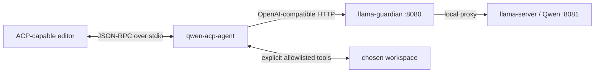

# Build Plan: ACP Wrapper for Local Qwen / llama.cpp

**Feature:** `acp-qwen-agent` — local ACP agent over stdio → llama-guardian `:8080`  
**Working branch:** `codex/qwen3-tuning-guardian-fix`  
**Wrapper root:** `scripts/acp-qwen-agent/`  
**Executor:** local Qwen via session handoff prompts (this file is the source of truth)

---

## Hard Constraints (executor must not violate)

1. **Do not modify** `ecosystem.config.cjs`, `scripts/llama-guardian.py`, PM2 process state, model/GPU/context/port settings.
2. **Do not restart, stop, or start** any PM2 / llama processes as part of this build.
3. All new code lives under `scripts/acp-qwen-agent/` only.
4. ACP protocol traffic only on **stdout**; diagnostics only on **stderr** (`console.error`).
5. Writes require **both** `ACP_ALLOW_WRITES=true` **and** an editor approval tied to the exact diff hash. Default is read-only.
6. No arbitrary shell tool, no network tools, no git mutators in v1.
7. Copy code blocks from this plan **verbatim**. Do not “improve” them.

---

## Codebase Primer (read fully before Session 1)

### What this repo is

`C:\Workspace\Infrastructure\llama-cpp-server` runs a local Qwen GGUF via `llama-server` behind **llama-guardian** (PM2). The guardian exposes an OpenAI-compatible API on **`http://127.0.0.1:8080/v1`**. The model server itself is on `:8081` and must not be called directly by this agent.

### What we are building

A small Node/TypeScript **ACP agent** that:

1. An ACP-capable editor launches as a **subprocess**.
2. Speaks **ACP JSON-RPC over stdio** (official `@agentclientprotocol/sdk`).
3. Calls Qwen through the guardian at `:8080/v1`.
4. Exposes a **tiny allowlisted tool surface** over a user-selected workspace.

Qwen stays an inference server. The wrapper owns the agent loop, ACP, tools, and safety policy.

### Architecture



### Target layout (end state)

```text
scripts/acp-qwen-agent/
  package.json
  package-lock.json
  tsconfig.json
  vitest.config.ts
  .gitignore
  .env.example
  README.md
  src/
    index.ts          # entry: CLI flags + ACP connect
    config.ts         # Zod env validation
    logger.ts         # stderr-only logging (no secrets/prompts by default)
    qwen/
      client.ts       # OpenAI-compatible client to :8080
      health.ts       # --health / --smoke helpers
    acp/
      agent.ts        # ACP handlers (initialize, session, prompt, cancel)
      session.ts      # session state
    tools/
      types.ts
      registry.ts
      list_files.ts
      read_file.ts
      search_text.ts
      propose_patch.ts
      apply_patch.ts
      path_guard.ts
    agent/
      loop.ts         # bounded model↔tool turn machine
      audit.ts        # metadata-only audit events
  test/
    config.test.ts
    path_guard.test.ts
    acp_init.test.ts
    tools_safety.test.ts
    fixtures/
      initialize_session_prompt.jsonl
```

### ACP SDK contract (verified against official example, 2026)

Use the modern builder API (not deprecated `AgentSideConnection` constructor):

```ts
import * as acp from "@agentclientprotocol/sdk";
import { Readable, Writable } from "node:stream";

const input = Writable.toWeb(process.stdout);
const output = Readable.toWeb(process.stdin) as ReadableStream<Uint8Array>;
const stream = acp.ndJsonStream(input, output);

acp
  .agent({ name: "qwen-acp-agent" })
  .onRequest("initialize", (ctx) => /* InitializeResponse */)
  .onRequest("session/new", (ctx) => /* NewSessionResponse */)
  .onRequest("authenticate", (ctx) => ({}))
  .onRequest("session/set_mode", (ctx) => ({}))
  .onRequest("session/prompt", (ctx) => /* PromptResponse using ctx.client */)
  .onNotification("session/cancel", (ctx) => /* void */)
  .connect(stream);
```

- `initialize` returns `{ protocolVersion: acp.PROTOCOL_VERSION, agentCapabilities: { loadSession: false }, ... }`.
- Prompt responses return `{ stopReason: "end_turn" | "cancelled" | ... }`.
- Stream agent text via `ctx.client.notify(acp.methods.client.session.update, { sessionId, update: { sessionUpdate: "agent_message_chunk", content: { type: "text", text } } })`.
- Write permission uses `ctx.client.request(acp.methods.client.session.requestPermission, ...)`.

### Environment variables (wrapper only)

| Variable | Default | Notes |
|---|---|---|
| `ACP_QWEN_BASE_URL` | `http://127.0.0.1:8080/v1` | Not a secret |
| `ACP_QWEN_MODEL` | `qwen3.6-35b` | Must match GET `/v1/models` id exactly |
| `ACP_WORKSPACE` | (required for tools/smoke) | Absolute path |
| `ACP_QWEN_TIMEOUT_MS` | `120000` | Finite timeout |
| `ACP_ALLOW_WRITES` | `false` | Hard gate |

Do **not** reuse unrelated app `.env` files. Real `.env` is gitignored under the wrapper folder.

### Success criteria (whole project)

1. `npm run check` and `npm test` pass in the wrapper folder.
2. Terminal smoke reaches Qwen via `:8080`.
3. ACP client can initialize and receive capability metadata.
4. Simple prompt → read-only file inspection + clear response.
5. Write path → proposed diff + explicit approval before any write.
6. Every tool action structured/logged without storing prompts/secrets by default.

---

## Session Map

| Session | Tasks | Focus |
|---|---|---|
| **1** | 1–3 | Baseline + scaffold + typed config + health CLI (no ACP loop yet) |
| **2** | 4–5 | Qwen client + ACP initialize/session/prompt (echo/model text, no tools) |
| **3** | 6–8 | Path guard + read-only tools + wire into agent loop |
| **4** | 9–11 | propose/apply patch gates + audit + reliability limits |
| **5** | 12–13 | Full tests, smoke, README, final verification |

**Orchestrator rule:** After each session, verify files/diff/tests before issuing the next session prompt. Do not let the executor advance early.

---

# Session 1 — Tasks 1–3

**Goal:** Create `scripts/acp-qwen-agent` as a typed Node package that validates config, can probe the guardian with `--health`, and has a stdio-safe entrypoint stub (no model chat loop yet).

---

## Task 1: Establish baseline (read-only)

### Steps

1. Run these PowerShell commands from the repo root. **Do not** restart PM2 or change guardian/server settings.

```powershell
Set-Location C:\Workspace\Infrastructure\llama-cpp-server
Get-Location
Get-Command node, npm, git
node -v
npm -v
git status --short
```

**Expected:**
- Location is `C:\Workspace\Infrastructure\llama-cpp-server`
- `node`, `npm`, `git` resolve
- Node is v20+ preferred (v18+ acceptable)
- `git status` may show `PLAN.md` / `plan.md` and other untracked files; that is fine

2. Probe the guardian (this may cold-start the model; that is OK):

```powershell
Invoke-RestMethod http://127.0.0.1:8080/v1/models
```

**Expected:** JSON object with a `data` array containing a model whose `id` is usable as `ACP_QWEN_MODEL`. Prefer the id that appears in the response (often `qwen3.6-35b`). Record the exact `id` string.

**Stop conditions:**
- If the request times out or fails: **STOP**. Report the full error. Inspect only with non-mutating diagnostics if needed (e.g. read logs). Do **not** run `pm2 restart/stop/start` or kill processes.
- If it succeeds: continue to Task 2.

3. Confirm the scaffold folder does not exist yet:

```powershell
Test-Path scripts\acp-qwen-agent
```

**Expected:** `False`. If `True`, STOP and report — do not overwrite without orchestrator guidance.

### Commit

No commit for Task 1.

---

## Task 2: Scaffold package files (full file contents)

### Steps

1. Create the directory:

```powershell
New-Item -ItemType Directory -Force -Path scripts\acp-qwen-agent\src, scripts\acp-qwen-agent\test | Out-Null
Set-Location scripts\acp-qwen-agent
```

2. Write **`package.json`** exactly:

```json
{
  "name": "acp-qwen-agent",
  "version": "0.1.0",
  "private": true,
  "description": "Local ACP agent wrapping Qwen via llama-guardian (OpenAI-compatible :8080)",
  "type": "module",
  "main": "dist/index.js",
  "bin": {
    "acp-qwen-agent": "./dist/index.js"
  },
  "scripts": {
    "dev": "tsx src/index.ts",
    "build": "tsc -p tsconfig.json",
    "start": "node dist/index.js",
    "check": "tsc -p tsconfig.json --noEmit",
    "test": "vitest run",
    "test:watch": "vitest"
  },
  "engines": {
    "node": ">=18"
  }
}
```

3. Write **`tsconfig.json`** exactly:

```json
{
  "compilerOptions": {
    "target": "ES2022",
    "module": "NodeNext",
    "moduleResolution": "NodeNext",
    "lib": ["ES2022"],
    "outDir": "dist",
    "rootDir": "src",
    "strict": true,
    "esModuleInterop": true,
    "skipLibCheck": true,
    "forceConsistentCasingInFileNames": true,
    "declaration": true,
    "sourceMap": true,
    "resolveJsonModule": true,
    "types": ["node"]
  },
  "include": ["src/**/*.ts"],
  "exclude": ["dist", "node_modules", "test"]
}
```

4. Write **`vitest.config.ts`** exactly:

```ts
import { defineConfig } from "vitest/config";

export default defineConfig({
  test: {
    environment: "node",
    include: ["test/**/*.test.ts"],
  },
});
```

5. Write **`.gitignore`** exactly:

```gitignore
node_modules/
dist/
.env
*.log
coverage/
.DS_Store
```

6. Write **`.env.example`** exactly:

```dotenv
# Copy to .env for local runs. Do not commit .env.
ACP_QWEN_BASE_URL=http://127.0.0.1:8080/v1
ACP_QWEN_MODEL=qwen3.6-35b
ACP_WORKSPACE=C:\Temp\acp-qwen-smoke
ACP_QWEN_TIMEOUT_MS=120000
ACP_ALLOW_WRITES=false
```

7. Write **`README.md`** exactly:

```markdown
# acp-qwen-agent

Local ACP agent that an editor launches over stdio. It talks to the local Qwen model through llama-guardian at `http://127.0.0.1:8080/v1`.

## Requirements

- Node.js 18+
- llama-guardian reachable on port 8080 (do not call llama-server :8081 directly)

## Setup

```powershell
Set-Location C:\Workspace\Infrastructure\llama-cpp-server\scripts\acp-qwen-agent
npm ci
copy .env.example .env
# edit .env: set ACP_WORKSPACE to an absolute disposable path
npm run check
npm test
npm run build
```

## CLI

```powershell
# Validate env + list models through guardian
npm run build
$env:ACP_QWEN_BASE_URL = 'http://127.0.0.1:8080/v1'
$env:ACP_QWEN_MODEL = 'qwen3.6-35b'
npm run start -- --health

# Later sessions add: npm run start -- --smoke
# Default (no flags): ACP JSON-RPC on stdio (editor launches this)
```

## Environment

| Variable | Default | Purpose |
|---|---|---|
| `ACP_QWEN_BASE_URL` | `http://127.0.0.1:8080/v1` | OpenAI-compatible base URL |
| `ACP_QWEN_MODEL` | `qwen3.6-35b` | Model id from `GET /v1/models` |
| `ACP_WORKSPACE` | (none) | Absolute workspace root for tools |
| `ACP_QWEN_TIMEOUT_MS` | `120000` | HTTP timeout |
| `ACP_ALLOW_WRITES` | `false` | Master write gate |

## Safety

- Stdout is ACP protocol only. Logs go to stderr.
- Writes are disabled unless `ACP_ALLOW_WRITES=true` **and** the editor approves the exact diff hash.
- v1 tools stay inside `ACP_WORKSPACE` only.

## Non-goals (v1)

No arbitrary shell, no network tools, no git commit/push/delete, no agent-os dependency.
```

8. Install dependencies (pin lockfile via npm; do not use global packages):

```powershell
npm install @agentclientprotocol/sdk openai zod
npm install --save-dev typescript tsx vitest @types/node
```

**Expected:** `package-lock.json` created; `node_modules` present; no peer-dep errors that prevent install. If npm prints version ranges into `package.json`, that is fine — leave the lockfile as npm wrote it.

9. Verify files exist:

```powershell
Get-ChildItem -Recurse -Name | Sort-Object
```

**Expected (at least):** `package.json`, `package-lock.json`, `tsconfig.json`, `vitest.config.ts`, `.gitignore`, `.env.example`, `README.md`, `src\`, `test\`, `node_modules\`

### Commit

```powershell
Set-Location C:\Workspace\Infrastructure\llama-cpp-server
git add scripts/acp-qwen-agent/package.json scripts/acp-qwen-agent/package-lock.json scripts/acp-qwen-agent/tsconfig.json scripts/acp-qwen-agent/vitest.config.ts scripts/acp-qwen-agent/.gitignore scripts/acp-qwen-agent/.env.example scripts/acp-qwen-agent/README.md
git commit -m "$(cat <<'EOF'
feat(acp): scaffold acp-qwen-agent package metadata

EOF
)"
```

If PowerShell heredoc fails, use:

```powershell
git commit -m "feat(acp): scaffold acp-qwen-agent package metadata"
```

---

## Task 3: Typed config, logger, health CLI, entry stub

### Steps

1. Write **`src/logger.ts`** exactly:

```ts
/**
 * Stderr-only logger. Never write diagnostics to stdout (ACP wire).
 * Do not log prompts, API keys, or full file contents by default.
 */
export type LogFields = Record<string, string | number | boolean | null | undefined>;

function formatFields(fields?: LogFields): string {
  if (!fields || Object.keys(fields).length === 0) return "";
  const parts = Object.entries(fields)
    .filter(([, v]) => v !== undefined)
    .map(([k, v]) => `${k}=${String(v)}`);
  return parts.length ? ` ${parts.join(" ")}` : "";
}

export function logInfo(message: string, fields?: LogFields): void {
  console.error(`[acp-qwen] info ${message}${formatFields(fields)}`);
}

export function logWarn(message: string, fields?: LogFields): void {
  console.error(`[acp-qwen] warn ${message}${formatFields(fields)}`);
}

export function logError(message: string, fields?: LogFields): void {
  console.error(`[acp-qwen] error ${message}${formatFields(fields)}`);
}
```

2. Write **`src/config.ts`** exactly:

```ts
import { z } from "zod";
import path from "node:path";

const ConfigSchema = z.object({
  baseUrl: z
    .string()
    .url()
    .default("http://127.0.0.1:8080/v1"),
  model: z.string().min(1).default("qwen3.6-35b"),
  workspace: z
    .string()
    .optional()
    .transform((v) => (v && v.trim() ? path.resolve(v.trim()) : undefined)),
  timeoutMs: z.coerce.number().int().positive().default(120_000),
  allowWrites: z
    .union([z.boolean(), z.string()])
    .default(false)
    .transform((v) => {
      if (typeof v === "boolean") return v;
      const s = v.trim().toLowerCase();
      return s === "1" || s === "true" || s === "yes";
    }),
});

export type AppConfig = z.infer<typeof ConfigSchema> & {
  workspace?: string;
  allowWrites: boolean;
};

export function loadConfig(env: NodeJS.ProcessEnv = process.env): AppConfig {
  const parsed = ConfigSchema.safeParse({
    baseUrl: env.ACP_QWEN_BASE_URL,
    model: env.ACP_QWEN_MODEL,
    workspace: env.ACP_WORKSPACE,
    timeoutMs: env.ACP_QWEN_TIMEOUT_MS,
    allowWrites: env.ACP_ALLOW_WRITES,
  });

  if (!parsed.success) {
    const detail = parsed.error.issues
      .map((i) => `${i.path.join(".") || "(root)"}: ${i.message}`)
      .join("; ");
    throw new Error(`Invalid configuration: ${detail}`);
  }

  return parsed.data as AppConfig;
}

export function requireWorkspace(config: AppConfig): string {
  if (!config.workspace) {
    throw new Error(
      "ACP_WORKSPACE is required for this command (absolute path to the workspace root)",
    );
  }
  return config.workspace;
}
```

3. Write **`src/qwen/health.ts`** exactly:

```ts
import type { AppConfig } from "../config.js";
import { logError, logInfo } from "../logger.js";

export type ModelsListResponse = {
  data?: Array<{ id?: string }>;
};

export async function fetchModels(config: AppConfig): Promise<ModelsListResponse> {
  const url = `${config.baseUrl.replace(/\/$/, "")}/models`;
  const controller = new AbortController();
  const timer = setTimeout(() => controller.abort(), config.timeoutMs);
  try {
    const res = await fetch(url, {
      method: "GET",
      signal: controller.signal,
      headers: { accept: "application/json" },
    });
    if (!res.ok) {
      const body = await res.text().catch(() => "");
      throw new Error(
        `GET ${url} failed: HTTP ${res.status} ${res.statusText}${body ? ` — ${body.slice(0, 200)}` : ""}`,
      );
    }
    return (await res.json()) as ModelsListResponse;
  } catch (err) {
    if (err instanceof Error && err.name === "AbortError") {
      throw new Error(
        `GET ${url} timed out after ${config.timeoutMs}ms (guardian may be cold-starting or down)`,
      );
    }
    throw err;
  } finally {
    clearTimeout(timer);
  }
}

export async function runHealthCheck(config: AppConfig): Promise<number> {
  try {
    const models = await fetchModels(config);
    const ids = (models.data ?? [])
      .map((m) => m.id)
      .filter((id): id is string => typeof id === "string" && id.length > 0);

    if (ids.length === 0) {
      logError("health check failed: /v1/models returned no model ids", {
        baseUrl: config.baseUrl,
      });
      return 1;
    }

    const modelPresent = ids.includes(config.model);
    logInfo("health ok", {
      baseUrl: config.baseUrl,
      configuredModel: config.model,
      modelPresent,
      models: ids.join(","),
    });

    if (!modelPresent) {
      logError("configured ACP_QWEN_MODEL not present in /v1/models", {
        configuredModel: config.model,
        available: ids.join(","),
      });
      return 1;
    }

    return 0;
  } catch (err) {
    logError("health check failed", {
      message: err instanceof Error ? err.message : String(err),
      baseUrl: config.baseUrl,
    });
    return 1;
  }
}
```

4. Write **`src/index.ts`** exactly:

```ts
#!/usr/bin/env node
/**
 * Entry point.
 * - `--health`: probe guardian /v1/models and exit
 * - (default): ACP stdio agent — Session 2 wires real handlers; Session 1 exits with guidance if stdin is a TTY
 *
 * stdout = ACP protocol only. All logs use stderr.
 */
import { loadConfig } from "./config.js";
import { logError, logInfo } from "./logger.js";
import { runHealthCheck } from "./qwen/health.js";

async function main(argv: string[]): Promise<number> {
  const args = argv.slice(2);

  if (args.includes("--help") || args.includes("-h")) {
    console.error(`acp-qwen-agent

Usage:
  acp-qwen-agent --health   Probe llama-guardian /v1/models
  acp-qwen-agent            Run ACP agent on stdio (editor-launched)

Environment:
  ACP_QWEN_BASE_URL   default http://127.0.0.1:8080/v1
  ACP_QWEN_MODEL      default qwen3.6-35b
  ACP_WORKSPACE       absolute workspace path (tools)
  ACP_QWEN_TIMEOUT_MS default 120000
  ACP_ALLOW_WRITES    default false
`);
    return 0;
  }

  let config;
  try {
    config = loadConfig();
  } catch (err) {
    logError(err instanceof Error ? err.message : String(err));
    return 1;
  }

  if (args.includes("--health")) {
    return runHealthCheck(config);
  }

  if (args.includes("--smoke")) {
    logError("--smoke is implemented in a later session; use --health for now");
    return 2;
  }

  // Session 1: ACP loop not wired yet. Refuse interactive TTY misuse clearly.
  if (process.stdin.isTTY) {
    logError(
      "ACP stdio mode expected (no TTY). Launch via an ACP client, or pass --health.",
    );
    return 2;
  }

  logInfo("ACP stdio mode not implemented yet (Session 2). Exiting.", {
    baseUrl: config.baseUrl,
    model: config.model,
  });
  return 2;
}

main(process.argv)
  .then((code) => {
    process.exitCode = code;
  })
  .catch((err) => {
    logError(err instanceof Error ? err.message : String(err));
    process.exitCode = 1;
  });
```

5. Write **`test/config.test.ts`** exactly:

```ts
import { afterEach, describe, expect, it } from "vitest";
import path from "node:path";
import { loadConfig, requireWorkspace } from "../src/config.js";

const ORIGINAL = { ...process.env };

afterEach(() => {
  process.env = { ...ORIGINAL };
});

describe("loadConfig", () => {
  it("applies defaults when env is empty", () => {
    delete process.env.ACP_QWEN_BASE_URL;
    delete process.env.ACP_QWEN_MODEL;
    delete process.env.ACP_WORKSPACE;
    delete process.env.ACP_QWEN_TIMEOUT_MS;
    delete process.env.ACP_ALLOW_WRITES;

    const cfg = loadConfig(process.env);
    expect(cfg.baseUrl).toBe("http://127.0.0.1:8080/v1");
    expect(cfg.model).toBe("qwen3.6-35b");
    expect(cfg.timeoutMs).toBe(120_000);
    expect(cfg.allowWrites).toBe(false);
    expect(cfg.workspace).toBeUndefined();
  });

  it("parses allowWrites truthy strings", () => {
    process.env.ACP_ALLOW_WRITES = "true";
    expect(loadConfig(process.env).allowWrites).toBe(true);
    process.env.ACP_ALLOW_WRITES = "1";
    expect(loadConfig(process.env).allowWrites).toBe(true);
    process.env.ACP_ALLOW_WRITES = "no";
    expect(loadConfig(process.env).allowWrites).toBe(false);
  });

  it("resolves workspace to an absolute path", () => {
    process.env.ACP_WORKSPACE = ".";
    const cfg = loadConfig(process.env);
    expect(cfg.workspace).toBe(path.resolve("."));
  });

  it("requireWorkspace throws when missing", () => {
    delete process.env.ACP_WORKSPACE;
    const cfg = loadConfig(process.env);
    expect(() => requireWorkspace(cfg)).toThrow(/ACP_WORKSPACE/);
  });
});
```

6. Run verification from `scripts/acp-qwen-agent`:

```powershell
Set-Location C:\Workspace\Infrastructure\llama-cpp-server\scripts\acp-qwen-agent
npm run check
npm test
npm run build
```

**Expected:**
- `check`: TypeScript exits 0, no errors
- `test`: vitest passes all config tests
- `build`: writes `dist/` with `index.js`, `config.js`, `logger.js`, `qwen/health.js`

7. Health smoke (guardian must be up from Task 1):

```powershell
$env:ACP_QWEN_BASE_URL = 'http://127.0.0.1:8080/v1'
$env:ACP_QWEN_MODEL = 'qwen3.6-35b'
# If Task 1 showed a different model id, use that exact id instead.
npm run start -- --health
echo "exit=$LASTEXITCODE"
```

**Expected:**
- stderr lines containing `health ok` with `modelPresent=true`
- exit code `0`
- **No** JSON-RPC or protocol chatter on stdout for `--health`

If model id mismatch: set `$env:ACP_QWEN_MODEL` to the exact id from Task 1 and re-run once. If still failing for connectivity, STOP and report (do not restart PM2).

8. Confirm TTY guard:

```powershell
npm run start
echo "exit=$LASTEXITCODE"
```

**Expected:** exit code `2` and a stderr message about ACP stdio / `--health`.

### Commit

```powershell
Set-Location C:\Workspace\Infrastructure\llama-cpp-server
git add scripts/acp-qwen-agent/src scripts/acp-qwen-agent/test scripts/acp-qwen-agent/package.json scripts/acp-qwen-agent/package-lock.json
git commit -m "feat(acp): add typed config, health check, and stdio entry stub"
```

---

# Session 2 — Tasks 4–5

**Status:** Session 1 verified (2026-07-12). Executor may run Tasks 4–5 only.

**Goal:** Non-streaming Qwen completion client + real ACP initialize/session/prompt over stdio (no filesystem tools yet).

---

## Task 4: Qwen OpenAI-compatible completion client

### Steps

1. Ensure you are in the wrapper folder:

```powershell
Set-Location C:\Workspace\Infrastructure\llama-cpp-server\scripts\acp-qwen-agent
```

2. Write **`src/qwen/client.ts`** exactly:

```ts
import OpenAI from "openai";
import type { AppConfig } from "../config.js";

export type ChatMessage = {
  role: "system" | "user" | "assistant";
  content: string;
};

export type CompleteChatParams = {
  messages: ChatMessage[];
  signal?: AbortSignal;
};

/**
 * Minimal surface used by the agent so tests can inject a fake.
 */
export type QwenChatClient = {
  completeChat(params: CompleteChatParams): Promise<string>;
};

function mapOpenAiError(err: unknown, baseUrl: string): Error {
  if (err instanceof Error && err.name === "AbortError") {
    return new Error(
      `Qwen request aborted or timed out talking to ${baseUrl} (guardian may be cold-starting or busy)`,
    );
  }

  const anyErr = err as {
    status?: number;
    code?: string;
    message?: string;
    cause?: unknown;
  };

  const status = anyErr?.status;
  const code = anyErr?.code;
  const message =
    err instanceof Error ? err.message : String(err ?? "unknown error");

  if (
    code === "ECONNREFUSED" ||
    code === "ENOTFOUND" ||
    /ECONNREFUSED|fetch failed|network/i.test(message)
  ) {
    return new Error(
      `Cannot reach llama-guardian at ${baseUrl}: ${message}. Is the guardian up on :8080?`,
    );
  }

  if (status === 502 || status === 503 || status === 504) {
    return new Error(
      `Guardian at ${baseUrl} returned HTTP ${status} (model may be cold-starting): ${message}`,
    );
  }

  return new Error(`Qwen completion failed (${baseUrl}): ${message}`);
}

export function createOpenAiClient(config: AppConfig): OpenAI {
  return new OpenAI({
    baseURL: config.baseUrl,
    apiKey: process.env.ACP_QWEN_API_KEY ?? "not-needed",
    timeout: config.timeoutMs,
  });
}

export function createQwenChatClient(
  config: AppConfig,
  openai: OpenAI = createOpenAiClient(config),
): QwenChatClient {
  return {
    async completeChat(params: CompleteChatParams): Promise<string> {
      try {
        const res = await openai.chat.completions.create(
          {
            model: config.model,
            messages: params.messages,
            stream: false,
          },
          { signal: params.signal },
        );

        const content = res.choices[0]?.message?.content;
        if (typeof content !== "string" || content.trim().length === 0) {
          throw new Error("Model returned empty content");
        }
        return content;
      } catch (err) {
        throw mapOpenAiError(err, config.baseUrl);
      }
    },
  };
}
```

3. Write **`test/qwen_client.test.ts`** exactly:

```ts
import { describe, expect, it, vi } from "vitest";
import type OpenAI from "openai";
import { createQwenChatClient } from "../src/qwen/client.js";
import type { AppConfig } from "../src/config.js";

const baseConfig: AppConfig = {
  baseUrl: "http://127.0.0.1:8080/v1",
  model: "qwen3.6-35b",
  timeoutMs: 5_000,
  allowWrites: false,
};

function fakeOpenAi(
  impl: () => Promise<{ choices: Array<{ message: { content: string | null } }> }>,
): OpenAI {
  return {
    chat: {
      completions: {
        create: vi.fn(impl),
      },
    },
  } as unknown as OpenAI;
}

describe("createQwenChatClient", () => {
  it("returns assistant text from a non-streaming completion", async () => {
    const openai = fakeOpenAi(async () => ({
      choices: [{ message: { content: "hello from qwen" } }],
    }));
    const client = createQwenChatClient(baseConfig, openai);
    const text = await client.completeChat({
      messages: [{ role: "user", content: "hi" }],
    });
    expect(text).toBe("hello from qwen");
  });

  it("maps empty content to an error", async () => {
    const openai = fakeOpenAi(async () => ({
      choices: [{ message: { content: "   " } }],
    }));
    const client = createQwenChatClient(baseConfig, openai);
    await expect(
      client.completeChat({ messages: [{ role: "user", content: "hi" }] }),
    ).rejects.toThrow(/empty content/i);
  });

  it("maps connection failures with guardian context", async () => {
    const err = Object.assign(new Error("fetch failed"), { code: "ECONNREFUSED" });
    const openai = fakeOpenAi(async () => {
      throw err;
    });
    const client = createQwenChatClient(baseConfig, openai);
    await expect(
      client.completeChat({ messages: [{ role: "user", content: "hi" }] }),
    ).rejects.toThrow(/llama-guardian|Cannot reach/i);
  });
});
```

4. Verify:

```powershell
npm run check
npm test
```

**Expected:** TypeScript clean; all previous tests + 3 new `qwen_client` tests pass.

### Commit

```powershell
Set-Location C:\Workspace\Infrastructure\llama-cpp-server
git add scripts/acp-qwen-agent/src/qwen/client.ts scripts/acp-qwen-agent/test/qwen_client.test.ts
git commit -m "feat(acp): add local llama.cpp completion client"
```

---

## Task 5: ACP initialize + session + prompt (no tools)

### Steps

1. Write **`src/acp/session.ts`** exactly:

```ts
export type AgentSession = {
  pendingPrompt: AbortController | null;
};

export class SessionStore {
  private readonly sessions = new Map<string, AgentSession>();

  create(): string {
    const sessionId = Array.from(crypto.getRandomValues(new Uint8Array(16)))
      .map((b) => b.toString(16).padStart(2, "0"))
      .join("");
    this.sessions.set(sessionId, { pendingPrompt: null });
    return sessionId;
  }

  get(sessionId: string): AgentSession | undefined {
    return this.sessions.get(sessionId);
  }

  cancel(sessionId: string): void {
    this.sessions.get(sessionId)?.pendingPrompt?.abort();
  }
}
```

2. Write **`src/acp/agent.ts`** exactly:

```ts
import * as acp from "@agentclientprotocol/sdk";
import type { AppConfig } from "../config.js";
import { logError, logInfo } from "../logger.js";
import type { QwenChatClient } from "../qwen/client.js";
import { SessionStore } from "./session.js";

const SYSTEM_PROMPT =
  "You are qwen-acp-agent, a helpful local coding assistant. " +
  "Answer clearly in Markdown. You do not have tools in this version; " +
  "do not invent tool results. Keep answers concise.";

const PACKAGE_VERSION = "0.1.0";

export type QwenAcpAgentDeps = {
  config: AppConfig;
  qwen: QwenChatClient;
  sessions?: SessionStore;
};

export function extractUserText(
  prompt: Array<{ type: string; text?: string }>,
): string {
  const parts: string[] = [];
  for (const block of prompt) {
    if (block.type === "text" && typeof block.text === "string") {
      parts.push(block.text);
    }
  }
  return parts.join("\n").trim();
}

export function createQwenAcpAgent(deps: QwenAcpAgentDeps) {
  const sessions = deps.sessions ?? new SessionStore();

  async function initialize(
    params: acp.InitializeRequest,
  ): Promise<acp.InitializeResponse> {
    logInfo("acp initialize", {
      clientProtocol: params.protocolVersion,
      agentProtocol: acp.PROTOCOL_VERSION,
    });
    return {
      protocolVersion: acp.PROTOCOL_VERSION,
      agentCapabilities: {
        loadSession: false,
        promptCapabilities: {
          image: false,
          audio: false,
          embeddedContext: false,
        },
      },
      agentInfo: {
        name: "qwen-acp-agent",
        version: PACKAGE_VERSION,
      },
      authMethods: [],
    };
  }

  async function newSession(
    _params: acp.NewSessionRequest,
  ): Promise<acp.NewSessionResponse> {
    const sessionId = sessions.create();
    logInfo("acp session/new", { sessionId });
    return { sessionId };
  }

  async function authenticate(
    _params: acp.AuthenticateRequest,
  ): Promise<acp.AuthenticateResponse | void> {
    return {};
  }

  async function setSessionMode(
    _params: acp.SetSessionModeRequest,
  ): Promise<acp.SetSessionModeResponse> {
    return {};
  }

  async function prompt(
    params: acp.PromptRequest,
    client: acp.AgentContext,
  ): Promise<acp.PromptResponse> {
    const session = sessions.get(params.sessionId);
    if (!session) {
      throw new Error(`Session ${params.sessionId} not found`);
    }

    session.pendingPrompt?.abort();
    session.pendingPrompt = new AbortController();
    const signal = session.pendingPrompt.signal;

    try {
      const userText = extractUserText(params.prompt);
      if (!userText) {
        await client.notify(acp.methods.client.session.update, {
          sessionId: params.sessionId,
          update: {
            sessionUpdate: "agent_message_chunk",
            content: {
              type: "text",
              text: "I did not receive any text in your prompt.",
            },
          },
        });
        return { stopReason: "end_turn" };
      }

      logInfo("acp session/prompt", {
        sessionId: params.sessionId,
        userChars: userText.length,
      });

      const answer = await deps.qwen.completeChat({
        messages: [
          { role: "system", content: SYSTEM_PROMPT },
          { role: "user", content: userText },
        ],
        signal,
      });

      if (signal.aborted) {
        return { stopReason: "cancelled" };
      }

      await client.notify(acp.methods.client.session.update, {
        sessionId: params.sessionId,
        update: {
          sessionUpdate: "agent_message_chunk",
          content: {
            type: "text",
            text: answer,
          },
        },
      });

      return { stopReason: "end_turn" };
    } catch (err) {
      if (signal.aborted) {
        return { stopReason: "cancelled" };
      }
      const message = err instanceof Error ? err.message : String(err);
      logError("acp prompt failed", { message, sessionId: params.sessionId });
      await client.notify(acp.methods.client.session.update, {
        sessionId: params.sessionId,
        update: {
          sessionUpdate: "agent_message_chunk",
          content: {
            type: "text",
            text: `**Error talking to local Qwen:** ${message}`,
          },
        },
      });
      return { stopReason: "end_turn" };
    } finally {
      session.pendingPrompt = null;
    }
  }

  async function cancel(params: acp.CancelNotification): Promise<void> {
    logInfo("acp session/cancel", { sessionId: params.sessionId });
    sessions.cancel(params.sessionId);
  }

  function buildApp(): acp.AgentApp {
    return acp
      .agent({ name: "qwen-acp-agent" })
      .onRequest(acp.methods.agent.initialize, (ctx) => initialize(ctx.params))
      .onRequest(acp.methods.agent.session.new, (ctx) => newSession(ctx.params))
      .onRequest(acp.methods.agent.authenticate, (ctx) =>
        authenticate(ctx.params),
      )
      .onRequest(acp.methods.agent.session.setMode, (ctx) =>
        setSessionMode(ctx.params),
      )
      .onRequest(acp.methods.agent.session.prompt, (ctx) =>
        prompt(ctx.params, ctx.client),
      )
      .onNotification(acp.methods.agent.session.cancel, (ctx) =>
        cancel(ctx.params),
      );
  }

  return {
    initialize,
    newSession,
    authenticate,
    setSessionMode,
    prompt,
    cancel,
    buildApp,
    sessions,
  };
}

export async function runAcpStdio(deps: QwenAcpAgentDeps): Promise<void> {
  const { Readable, Writable } = await import("node:stream");
  const input = Writable.toWeb(process.stdout);
  const output = Readable.toWeb(process.stdin) as ReadableStream<Uint8Array>;
  const stream = acp.ndJsonStream(input, output);
  const agent = createQwenAcpAgent(deps);
  const connection = agent.buildApp().connect(stream);
  logInfo("acp stdio connected", {
    baseUrl: deps.config.baseUrl,
    model: deps.config.model,
  });
  await connection.closed;
}
```

3. **Replace** **`src/index.ts`** entirely with:

```ts
#!/usr/bin/env node
/**
 * Entry point.
 * - `--health`: probe guardian /v1/models and exit
 * - default: ACP JSON-RPC on stdio (stdout = protocol only)
 */
import { loadConfig } from "./config.js";
import { logError, logInfo } from "./logger.js";
import { runHealthCheck } from "./qwen/health.js";
import { createQwenChatClient } from "./qwen/client.js";
import { runAcpStdio } from "./acp/agent.js";

async function main(argv: string[]): Promise<number> {
  const args = argv.slice(2);

  if (args.includes("--help") || args.includes("-h")) {
    console.error(`acp-qwen-agent

Usage:
  acp-qwen-agent --health   Probe llama-guardian /v1/models
  acp-qwen-agent            Run ACP agent on stdio (editor-launched)

Environment:
  ACP_QWEN_BASE_URL   default http://127.0.0.1:8080/v1
  ACP_QWEN_MODEL      default qwen3.6-35b
  ACP_WORKSPACE       absolute workspace path (tools; later sessions)
  ACP_QWEN_TIMEOUT_MS default 120000
  ACP_ALLOW_WRITES    default false
`);
    return 0;
  }

  let config;
  try {
    config = loadConfig();
  } catch (err) {
    logError(err instanceof Error ? err.message : String(err));
    return 1;
  }

  if (args.includes("--health")) {
    return runHealthCheck(config);
  }

  if (args.includes("--smoke")) {
    logError("--smoke is implemented in a later session; use --health for now");
    return 2;
  }

  if (process.stdin.isTTY) {
    logError(
      "ACP stdio mode expected (no TTY). Launch via an ACP client, or pass --health.",
    );
    return 2;
  }

  try {
    const qwen = createQwenChatClient(config);
    logInfo("starting acp stdio agent", {
      baseUrl: config.baseUrl,
      model: config.model,
    });
    await runAcpStdio({ config, qwen });
    return 0;
  } catch (err) {
    logError(err instanceof Error ? err.message : String(err));
    return 1;
  }
}

main(process.argv)
  .then((code) => {
    process.exitCode = code;
  })
  .catch((err) => {
    logError(err instanceof Error ? err.message : String(err));
    process.exitCode = 1;
  });
```

4. Write **`test/acp_init.test.ts`** exactly:

```ts
import { describe, expect, it, vi } from "vitest";
import * as acp from "@agentclientprotocol/sdk";
import { createQwenAcpAgent, extractUserText } from "../src/acp/agent.js";
import type { AppConfig } from "../src/config.js";
import type { QwenChatClient } from "../src/qwen/client.js";

const config: AppConfig = {
  baseUrl: "http://127.0.0.1:8080/v1",
  model: "qwen3.6-35b",
  timeoutMs: 5_000,
  allowWrites: false,
};

describe("extractUserText", () => {
  it("joins text blocks and ignores others", () => {
    expect(
      extractUserText([
        { type: "text", text: "hello" },
        { type: "image" },
        { type: "text", text: "world" },
      ]),
    ).toBe("hello\nworld");
  });
});

describe("createQwenAcpAgent", () => {
  it("initialize advertises protocol + agentInfo", async () => {
    const qwen: QwenChatClient = {
      completeChat: vi.fn(),
    };
    const agent = createQwenAcpAgent({ config, qwen });
    const res = await agent.initialize({
      protocolVersion: acp.PROTOCOL_VERSION,
      clientCapabilities: {},
    });
    expect(res.protocolVersion).toBe(acp.PROTOCOL_VERSION);
    expect(res.agentCapabilities?.loadSession).toBe(false);
    expect(res.agentInfo?.name).toBe("qwen-acp-agent");
    expect(res.agentInfo?.version).toBe("0.1.0");
  });

  it("newSession returns a hex session id", async () => {
    const qwen: QwenChatClient = { completeChat: vi.fn() };
    const agent = createQwenAcpAgent({ config, qwen });
    const res = await agent.newSession({
      cwd: "C:\\Temp",
      mcpServers: [],
    });
    expect(res.sessionId).toMatch(/^[0-9a-f]{32}$/);
    expect(agent.sessions.get(res.sessionId)).toBeDefined();
  });

  it("in-process initialize → session/new → prompt returns model text", async () => {
    const chunks: string[] = [];
    const qwen: QwenChatClient = {
      completeChat: vi.fn(async () => "pong from mock qwen"),
    };
    const agentApp = createQwenAcpAgent({ config, qwen }).buildApp();

    const result = await acp
      .client({ name: "test-client" })
      .onNotification(acp.methods.client.session.update, (ctx) => {
        const update = ctx.params.update;
        if (
          update.sessionUpdate === "agent_message_chunk" &&
          update.content.type === "text"
        ) {
          chunks.push(update.content.text);
        }
      })
      .connectWith(agentApp, async (agentCx) => {
        const init = await agentCx.request(acp.methods.agent.initialize, {
          protocolVersion: acp.PROTOCOL_VERSION,
          clientCapabilities: {},
        });
        const session = await agentCx.request(acp.methods.agent.session.new, {
          cwd: "C:\\Temp\\acp-test",
          mcpServers: [],
        });
        const prompt = await agentCx.request(acp.methods.agent.session.prompt, {
          sessionId: session.sessionId,
          prompt: [{ type: "text", text: "ping" }],
        });
        return { init, session, prompt };
      });

    expect(result.init.protocolVersion).toBe(acp.PROTOCOL_VERSION);
    expect(result.session.sessionId).toMatch(/^[0-9a-f]{32}$/);
    expect(result.prompt.stopReason).toBe("end_turn");
    expect(chunks.join("")).toBe("pong from mock qwen");
    expect(qwen.completeChat).toHaveBeenCalledOnce();
  });
});
```

5. Write **`test/fixtures/initialize_session_prompt.jsonl`** exactly (documentation fixture; not auto-run):

```jsonl
{"jsonrpc":"2.0","id":1,"method":"initialize","params":{"protocolVersion":1,"clientCapabilities":{}}}
{"jsonrpc":"2.0","id":1,"result":{"protocolVersion":1,"agentCapabilities":{"loadSession":false},"agentInfo":{"name":"qwen-acp-agent","version":"0.1.0"},"authMethods":[]}}
{"jsonrpc":"2.0","id":2,"method":"session/new","params":{"cwd":"C:\\Temp\\acp-test","mcpServers":[]}}
{"jsonrpc":"2.0","id":2,"result":{"sessionId":"0123456789abcdef0123456789abcdef"}}
{"jsonrpc":"2.0","id":3,"method":"session/prompt","params":{"sessionId":"0123456789abcdef0123456789abcdef","prompt":[{"type":"text","text":"ping"}]}}
{"jsonrpc":"2.0","method":"session/update","params":{"sessionId":"0123456789abcdef0123456789abcdef","update":{"sessionUpdate":"agent_message_chunk","content":{"type":"text","text":"pong"}}}}
{"jsonrpc":"2.0","id":3,"result":{"stopReason":"end_turn"}}
```

6. Verify:

```powershell
Set-Location C:\Workspace\Infrastructure\llama-cpp-server\scripts\acp-qwen-agent
npm run check
npm test
npm run build
npm run start -- --health
```

**Expected:**
- `check` / `test` / `build` all exit 0
- tests include config + qwen_client + acp_init (in-process handshake)
- `--health` still prints `health ok` with `modelPresent=true` and exit 0

7. Optional live stdio smoke (do **not** fail the session if Qwen is slow; report output). PowerShell:

```powershell
$psi = @{
  FilePath = "node"
  ArgumentList = "dist/index.js"
  RedirectStandardInput = $true
  RedirectStandardOutput = $true
  RedirectStandardError = $true
  UseShellExecute = $false
  WorkingDirectory = (Get-Location).Path
}
# Prefer the in-process vitest coverage above. Live pipe tests are optional.
```

Do **not** add filesystem tools in this session.

### Commit

```powershell
Set-Location C:\Workspace\Infrastructure\llama-cpp-server
git add scripts/acp-qwen-agent/src/acp scripts/acp-qwen-agent/src/index.ts scripts/acp-qwen-agent/test/acp_init.test.ts scripts/acp-qwen-agent/test/fixtures
git commit -m "feat(acp): implement initialize and prompt session flow"
```

**Stop/Go:** Do not start Session 3 (filesystem tools) until orchestrator verifies Session 2.

---


# Session 3 — Tasks 6–8

**Status:** Session 2 verified (2026-07-12). Executor may run Tasks 6–8 only.

**Goal:** Workspace path guard, metadata audit log, read-only tools (`list_files`, `read_file`, `search_text`), and a bounded agent loop that can call **one tool at a time** (no writes).

**Notes from Session 2 verification:**
- Tasks 4–5 landed in a single commit `e2f0bab` (acceptable; code matches plan).
- `test/fixtures/*.jsonl` is ignored by a parent `*.jsonl` gitignore rule — leave as local docs; do not fight gitignore this session.

---

## Task 6: Path guard + audit stub

### Steps

1. Working directory:

```powershell
Set-Location C:\Workspace\Infrastructure\llama-cpp-server\scripts\acp-qwen-agent
New-Item -ItemType Directory -Force -Path src\tools, src\agent, test\tmp-workspace | Out-Null
```

2. Write **`src/tools/path_guard.ts`** exactly:

```ts
import fs from "node:fs";
import path from "node:path";

export class PathGuardError extends Error {
  constructor(message: string) {
    super(message);
    this.name = "PathGuardError";
  }
}

function isInsideWorkspace(workspaceRoot: string, candidate: string): boolean {
  const root = workspaceRoot.endsWith(path.sep)
    ? workspaceRoot
    : workspaceRoot + path.sep;
  return candidate === workspaceRoot || candidate.startsWith(root);
}

/**
 * Resolve `userPath` against the workspace and require the real path to stay inside.
 * Rejects `..` escapes, absolute paths outside workspace, and symlink escapes.
 */
export function resolveInsideWorkspace(
  workspaceRoot: string,
  userPath: string,
): string {
  if (!workspaceRoot || !path.isAbsolute(workspaceRoot)) {
    throw new PathGuardError("workspace root must be an absolute path");
  }
  if (typeof userPath !== "string" || userPath.trim().length === 0) {
    throw new PathGuardError("path is required");
  }

  const rootReal = fs.realpathSync.native(workspaceRoot);
  const joined = path.isAbsolute(userPath)
    ? path.normalize(userPath)
    : path.normalize(path.join(rootReal, userPath));

  // If the path exists, resolve symlinks; otherwise resolve the nearest existing parent.
  let realCandidate: string;
  try {
    realCandidate = fs.realpathSync.native(joined);
  } catch {
    let parent = path.dirname(joined);
    let leaf = path.basename(joined);
    const parts: string[] = [leaf];
    while (true) {
      try {
        const realParent = fs.realpathSync.native(parent);
        realCandidate = path.normalize(path.join(realParent, ...parts.reverse()));
        break;
      } catch {
        const nextParent = path.dirname(parent);
        if (nextParent === parent) {
          throw new PathGuardError(`path does not resolve inside workspace: ${userPath}`);
        }
        parts.push(path.basename(parent));
        parent = nextParent;
      }
    }
  }

  if (!isInsideWorkspace(rootReal, realCandidate)) {
    throw new PathGuardError(
      `path escapes workspace: ${userPath} -> ${realCandidate}`,
    );
  }
  return realCandidate;
}

export function toWorkspaceRelative(
  workspaceRoot: string,
  absolutePath: string,
): string {
  const rootReal = fs.realpathSync.native(workspaceRoot);
  const rel = path.relative(rootReal, absolutePath);
  if (rel.startsWith("..") || path.isAbsolute(rel)) {
    throw new PathGuardError("path is outside workspace");
  }
  return rel.length === 0 ? "." : rel;
}
```

3. Write **`src/agent/audit.ts`** exactly:

```ts
import { logInfo } from "../logger.js";

export type AuditEvent = {
  ts: string;
  kind: string;
  ok: boolean;
  tool?: string;
  durationMs?: number;
  detail?: string;
  sessionId?: string;
};

/**
 * Metadata-only audit trail. Never store prompts, file contents, or secrets.
 */
export class AuditLog {
  private readonly events: AuditEvent[] = [];

  record(event: Omit<AuditEvent, "ts"> & { ts?: string }): AuditEvent {
    const full: AuditEvent = {
      ts: event.ts ?? new Date().toISOString(),
      kind: event.kind,
      ok: event.ok,
      tool: event.tool,
      durationMs: event.durationMs,
      detail: event.detail,
      sessionId: event.sessionId,
    };
    this.events.push(full);
    logInfo("audit", {
      kind: full.kind,
      ok: full.ok,
      tool: full.tool ?? "",
      durationMs: full.durationMs ?? -1,
      detail: full.detail ?? "",
      sessionId: full.sessionId ?? "",
    });
    return full;
  }

  list(): readonly AuditEvent[] {
    return this.events;
  }
}
```

4. Write **`test/path_guard.test.ts`** exactly:

```ts
import fs from "node:fs";
import os from "node:os";
import path from "node:path";
import { afterEach, beforeEach, describe, expect, it } from "vitest";
import {
  PathGuardError,
  resolveInsideWorkspace,
  toWorkspaceRelative,
} from "../src/tools/path_guard.js";

let root: string;

beforeEach(() => {
  root = fs.mkdtempSync(path.join(os.tmpdir(), "acp-path-"));
  fs.writeFileSync(path.join(root, "ok.txt"), "hello", "utf8");
  fs.mkdirSync(path.join(root, "sub"));
  fs.writeFileSync(path.join(root, "sub", "nested.txt"), "n", "utf8");
});

afterEach(() => {
  fs.rmSync(root, { recursive: true, force: true });
});

describe("resolveInsideWorkspace", () => {
  it("allows relative paths inside workspace", () => {
    const p = resolveInsideWorkspace(root, "sub/nested.txt");
    expect(p).toBe(fs.realpathSync.native(path.join(root, "sub", "nested.txt")));
  });

  it("allows absolute paths inside workspace", () => {
    const abs = path.join(root, "ok.txt");
    expect(resolveInsideWorkspace(root, abs)).toBe(fs.realpathSync.native(abs));
  });

  it("rejects .. traversal escape", () => {
    expect(() => resolveInsideWorkspace(root, "../outside.txt")).toThrow(
      PathGuardError,
    );
  });

  it("rejects absolute path outside workspace", () => {
    const outside = path.join(os.tmpdir(), "acp-outside-not-ws.txt");
    fs.writeFileSync(outside, "x", "utf8");
    try {
      expect(() => resolveInsideWorkspace(root, outside)).toThrow(PathGuardError);
    } finally {
      fs.unlinkSync(outside);
    }
  });

  it("rejects symlink escape when supported", () => {
    const outsideDir = fs.mkdtempSync(path.join(os.tmpdir(), "acp-out-"));
    const outsideFile = path.join(outsideDir, "secret.txt");
    fs.writeFileSync(outsideFile, "secret", "utf8");
    const linkPath = path.join(root, "escape-link");
    try {
      fs.symlinkSync(outsideDir, linkPath, "junction");
    } catch {
      // Some environments block symlinks; skip rather than fail the suite.
      fs.rmSync(outsideDir, { recursive: true, force: true });
      return;
    }
    try {
      expect(() =>
        resolveInsideWorkspace(root, path.join("escape-link", "secret.txt")),
      ).toThrow(PathGuardError);
    } finally {
      fs.rmSync(linkPath, { recursive: true, force: true });
      fs.rmSync(outsideDir, { recursive: true, force: true });
    }
  });

  it("toWorkspaceRelative returns relative path", () => {
    const abs = resolveInsideWorkspace(root, "ok.txt");
    expect(toWorkspaceRelative(root, abs).replaceAll("\\", "/")).toBe("ok.txt");
  });
});
```

5. Write **`test/audit.test.ts`** exactly:

```ts
import { describe, expect, it } from "vitest";
import { AuditLog } from "../src/agent/audit.js";

describe("AuditLog", () => {
  it("records metadata-only events", () => {
    const audit = new AuditLog();
    const e = audit.record({
      kind: "tool",
      ok: true,
      tool: "list_files",
      durationMs: 3,
      detail: "count=2",
      sessionId: "abc",
    });
    expect(e.ts).toBeTruthy();
    expect(audit.list()).toHaveLength(1);
    expect(audit.list()[0]?.tool).toBe("list_files");
  });
});
```

6. Verify:

```powershell
npm run check
npm test
```

**Expected:** previous tests still pass; new path_guard + audit tests pass.

### Commit

```powershell
Set-Location C:\Workspace\Infrastructure\llama-cpp-server
git add scripts/acp-qwen-agent/src/tools/path_guard.ts scripts/acp-qwen-agent/src/agent/audit.ts scripts/acp-qwen-agent/test/path_guard.test.ts scripts/acp-qwen-agent/test/audit.test.ts
git commit -m "feat(acp): add workspace path guard and audit events"
```

---

## Task 7: Read-only tools

### Steps

1. Write **`src/tools/types.ts`** exactly:

```ts
import { z } from "zod";

export const MAX_TOOL_OUTPUT_CHARS = 24_000;
export const MAX_READ_BYTES = 256_000;
export const MAX_LIST_ENTRIES = 500;
export const MAX_LIST_DEPTH = 4;
export const MAX_SEARCH_MATCHES = 50;

export type ToolResult = {
  ok: boolean;
  output: string;
};

export type ToolContext = {
  workspaceRoot: string;
};

export type ToolDefinition = {
  name: string;
  description: string;
  parameters: z.ZodTypeAny;
  /** OpenAI-style JSON schema parameters object */
  parametersJsonSchema: Record<string, unknown>;
  execute: (args: unknown, ctx: ToolContext) => Promise<ToolResult>;
};

export function truncateOutput(text: string, max = MAX_TOOL_OUTPUT_CHARS): string {
  if (text.length <= max) return text;
  return `${text.slice(0, max)}\n...[truncated ${text.length - max} chars]`;
}
```

2. Write **`src/tools/list_files.ts`** exactly:

```ts
import fs from "node:fs";
import path from "node:path";
import { z } from "zod";
import {
  resolveInsideWorkspace,
  toWorkspaceRelative,
} from "./path_guard.js";
import {
  MAX_LIST_DEPTH,
  MAX_LIST_ENTRIES,
  truncateOutput,
  type ToolContext,
  type ToolDefinition,
  type ToolResult,
} from "./types.js";

const SKIP_DIR_NAMES = new Set([
  ".git",
  "node_modules",
  "models",
  "logs",
  "dist",
  "coverage",
]);

function isSkippedName(name: string): boolean {
  if (SKIP_DIR_NAMES.has(name)) return true;
  if (name === ".env" || name.startsWith(".env.")) return true;
  if (name.endsWith(".pem") || name.endsWith(".key")) return true;
  return false;
}

const Params = z.object({
  path: z.string().default("."),
  maxDepth: z.number().int().min(0).max(MAX_LIST_DEPTH).default(2),
});

async function execute(args: unknown, ctx: ToolContext): Promise<ToolResult> {
  const parsed = Params.safeParse(args ?? {});
  if (!parsed.success) {
    return { ok: false, output: `invalid args: ${parsed.error.message}` };
  }
  const start = resolveInsideWorkspace(ctx.workspaceRoot, parsed.data.path);
  const maxDepth = parsed.data.maxDepth;
  const lines: string[] = [];
  let count = 0;
  let truncated = false;

  function walk(dir: string, depth: number): void {
    if (truncated || count >= MAX_LIST_ENTRIES) {
      truncated = true;
      return;
    }
    let entries: fs.Dirent[];
    try {
      entries = fs.readdirSync(dir, { withFileTypes: true });
    } catch (err) {
      lines.push(
        `! cannot read ${toWorkspaceRelative(ctx.workspaceRoot, dir)}: ${
          err instanceof Error ? err.message : String(err)
        }`,
      );
      return;
    }
    entries.sort((a, b) => a.name.localeCompare(b.name));
    for (const ent of entries) {
      if (truncated || count >= MAX_LIST_ENTRIES) {
        truncated = true;
        return;
      }
      if (isSkippedName(ent.name)) continue;
      const full = path.join(dir, ent.name);
      const rel = toWorkspaceRelative(ctx.workspaceRoot, full).replaceAll("\\", "/");
      if (ent.isDirectory()) {
        lines.push(`${rel}/`);
        count += 1;
        if (depth < maxDepth) walk(full, depth + 1);
      } else if (ent.isFile()) {
        lines.push(rel);
        count += 1;
      }
    }
  }

  const st = fs.statSync(start);
  if (st.isFile()) {
    const rel = toWorkspaceRelative(ctx.workspaceRoot, start).replaceAll("\\", "/");
    return { ok: true, output: truncateOutput(rel) };
  }
  walk(start, 0);
  const body =
    lines.join("\n") +
    (truncated ? `\n...[truncated at ${MAX_LIST_ENTRIES} entries]` : "");
  return { ok: true, output: truncateOutput(body || "(empty)") };
}

export const listFilesTool: ToolDefinition = {
  name: "list_files",
  description:
    "List files and directories under a workspace-relative path. Depth-capped; skips .git, node_modules, models, logs, secrets.",
  parameters: Params,
  parametersJsonSchema: {
    type: "object",
    properties: {
      path: {
        type: "string",
        description: "Workspace-relative or absolute-inside-workspace path",
        default: ".",
      },
      maxDepth: {
        type: "integer",
        minimum: 0,
        maximum: MAX_LIST_DEPTH,
        default: 2,
      },
    },
    additionalProperties: false,
  },
  execute,
};
```

3. Write **`src/tools/read_file.ts`** exactly:

```ts
import fs from "node:fs";
import { z } from "zod";
import { resolveInsideWorkspace, toWorkspaceRelative } from "./path_guard.js";
import {
  MAX_READ_BYTES,
  truncateOutput,
  type ToolContext,
  type ToolDefinition,
  type ToolResult,
} from "./types.js";

const Params = z.object({
  path: z.string().min(1),
});

function looksBinary(buf: Buffer): boolean {
  const sample = buf.subarray(0, Math.min(buf.length, 8000));
  if (sample.includes(0)) return true;
  let weird = 0;
  for (const b of sample) {
    if (b === 9 || b === 10 || b === 13) continue;
    if (b < 32 || b === 127) weird += 1;
  }
  return weird / Math.max(sample.length, 1) > 0.3;
}

async function execute(args: unknown, ctx: ToolContext): Promise<ToolResult> {
  const parsed = Params.safeParse(args ?? {});
  if (!parsed.success) {
    return { ok: false, output: `invalid args: ${parsed.error.message}` };
  }
  const abs = resolveInsideWorkspace(ctx.workspaceRoot, parsed.data.path);
  const st = fs.statSync(abs);
  if (!st.isFile()) {
    return { ok: false, output: "not a regular file" };
  }
  if (st.size > MAX_READ_BYTES) {
    return {
      ok: false,
      output: `file too large (${st.size} bytes > ${MAX_READ_BYTES})`,
    };
  }
  const buf = fs.readFileSync(abs);
  if (looksBinary(buf)) {
    return { ok: false, output: "binary file rejected (UTF-8 text only)" };
  }
  const text = buf.toString("utf8");
  const rel = toWorkspaceRelative(ctx.workspaceRoot, abs).replaceAll("\\", "/");
  return {
    ok: true,
    output: truncateOutput(`# ${rel}\n${text}`),
  };
}

export const readFileTool: ToolDefinition = {
  name: "read_file",
  description:
    "Read a UTF-8 text file inside the workspace. Rejects binary and oversized files.",
  parameters: Params,
  parametersJsonSchema: {
    type: "object",
    properties: {
      path: {
        type: "string",
        description: "Workspace-relative path to read",
      },
    },
    required: ["path"],
    additionalProperties: false,
  },
  execute,
};
```

4. Write **`src/tools/search_text.ts`** exactly:

```ts
import { spawn } from "node:child_process";
import { z } from "zod";
import { resolveInsideWorkspace, toWorkspaceRelative } from "./path_guard.js";
import {
  MAX_SEARCH_MATCHES,
  truncateOutput,
  type ToolContext,
  type ToolDefinition,
  type ToolResult,
} from "./types.js";

const Params = z.object({
  pattern: z.string().min(1).max(200),
  path: z.string().default("."),
});

function runRg(
  args: string[],
  cwd: string,
): Promise<{ code: number | null; stdout: string; stderr: string }> {
  return new Promise((resolve, reject) => {
    const child = spawn("rg", args, {
      cwd,
      windowsHide: true,
      shell: false,
    });
    let stdout = "";
    let stderr = "";
    child.stdout.on("data", (c) => {
      stdout += c.toString("utf8");
      if (stdout.length > 200_000) stdout = stdout.slice(0, 200_000);
    });
    child.stderr.on("data", (c) => {
      stderr += c.toString("utf8");
    });
    child.on("error", (err) => reject(err));
    child.on("close", (code) => resolve({ code, stdout, stderr }));
  });
}

async function execute(args: unknown, ctx: ToolContext): Promise<ToolResult> {
  const parsed = Params.safeParse(args ?? {});
  if (!parsed.success) {
    return { ok: false, output: `invalid args: ${parsed.error.message}` };
  }
  const scope = resolveInsideWorkspace(ctx.workspaceRoot, parsed.data.path);
  const relScope = toWorkspaceRelative(ctx.workspaceRoot, scope).replaceAll(
    "\\",
    "/",
  );

  // Fixed safe args only — pattern is a search string, not a shell command.
  const rgArgs = [
    "--line-number",
    "--with-filename",
    "--no-heading",
    "--color",
    "never",
    "--max-count",
    String(MAX_SEARCH_MATCHES),
    "--glob",
    "!**/.git/**",
    "--glob",
    "!**/node_modules/**",
    "--glob",
    "!**/models/**",
    "--glob",
    "!**/logs/**",
    "--fixed-strings",
    parsed.data.pattern,
    scope,
  ];

  try {
    const { code, stdout, stderr } = await runRg(rgArgs, ctx.workspaceRoot);
    // rg: 0 matches, 1 no matches, 2 error
    if (code === 2) {
      return {
        ok: false,
        output: truncateOutput(`rg error: ${stderr || "unknown"}`),
      };
    }
    if (!stdout.trim()) {
      return {
        ok: true,
        output: `No matches for ${JSON.stringify(parsed.data.pattern)} under ${relScope}`,
      };
    }
    // Rewrite absolute paths to workspace-relative when possible.
    const lines = stdout
      .split(/\r?\n/)
      .filter(Boolean)
      .slice(0, MAX_SEARCH_MATCHES)
      .map((line) => {
        const idx = line.indexOf(":");
        if (idx === -1) return line;
        // filename:line:text — filename may contain drive letters on Windows
        const m = line.match(/^(.*?):(\d+):(.*)$/);
        if (!m) return line;
        const file = m[1]!;
        const ln = m[2]!;
        const text = m[3]!;
        try {
          const rel = toWorkspaceRelative(
            ctx.workspaceRoot,
            file,
          ).replaceAll("\\", "/");
          return `${rel}:${ln}:${text}`;
        } catch {
          return line;
        }
      });
    return { ok: true, output: truncateOutput(lines.join("\n")) };
  } catch (err) {
    const message = err instanceof Error ? err.message : String(err);
    if (/ENOENT/i.test(message)) {
      return {
        ok: false,
        output:
          "rg (ripgrep) not found on PATH. Install ripgrep or ensure `rg` is available.",
      };
    }
    return { ok: false, output: `search failed: ${message}` };
  }
}

export const searchTextTool: ToolDefinition = {
  name: "search_text",
  description:
    "Search for a fixed string in the workspace using ripgrep (rg). No shell. Pattern is literal text.",
  parameters: Params,
  parametersJsonSchema: {
    type: "object",
    properties: {
      pattern: {
        type: "string",
        description: "Literal text to search for (fixed string, not regex)",
      },
      path: {
        type: "string",
        description: "Workspace-relative scope",
        default: ".",
      },
    },
    required: ["pattern"],
    additionalProperties: false,
  },
  execute,
};
```

5. Write **`src/tools/registry.ts`** exactly:

```ts
import { listFilesTool } from "./list_files.js";
import { readFileTool } from "./read_file.js";
import { searchTextTool } from "./search_text.js";
import type { ToolContext, ToolDefinition, ToolResult } from "./types.js";
import { PathGuardError } from "./path_guard.js";
import { truncateOutput } from "./types.js";

const tools: ToolDefinition[] = [listFilesTool, readFileTool, searchTextTool];

export function getToolDefinitions(): ToolDefinition[] {
  return tools;
}

export function getOpenAiToolSpecs(): Array<{
  type: "function";
  function: {
    name: string;
    description: string;
    parameters: Record<string, unknown>;
  };
}> {
  return tools.map((t) => ({
    type: "function" as const,
    function: {
      name: t.name,
      description: t.description,
      parameters: t.parametersJsonSchema,
    },
  }));
}

export async function executeTool(
  name: string,
  args: unknown,
  ctx: ToolContext,
): Promise<ToolResult> {
  const tool = tools.find((t) => t.name === name);
  if (!tool) {
    return { ok: false, output: `unknown tool: ${name}` };
  }
  try {
    const result = await tool.execute(args, ctx);
    return {
      ok: result.ok,
      output: truncateOutput(result.output),
    };
  } catch (err) {
    if (err instanceof PathGuardError) {
      return { ok: false, output: `path rejected: ${err.message}` };
    }
    return {
      ok: false,
      output: err instanceof Error ? err.message : String(err),
    };
  }
}
```

6. Write **`test/tools_safety.test.ts`** exactly:

```ts
import fs from "node:fs";
import os from "node:os";
import path from "node:path";
import { afterEach, beforeEach, describe, expect, it } from "vitest";
import { executeTool, getToolDefinitions } from "../src/tools/registry.js";

let root: string;

beforeEach(() => {
  root = fs.mkdtempSync(path.join(os.tmpdir(), "acp-tools-"));
  fs.writeFileSync(path.join(root, "readme.md"), "# Hello\nsearch-token-xyz\n", "utf8");
  fs.mkdirSync(path.join(root, "src"));
  fs.writeFileSync(path.join(root, "src", "app.ts"), "export const n = 1;\n", "utf8");
  fs.mkdirSync(path.join(root, "node_modules", "pkg"), { recursive: true });
  fs.writeFileSync(path.join(root, "node_modules", "pkg", "x.js"), "nope", "utf8");
  fs.writeFileSync(path.join(root, "binary.bin"), Buffer.from([0, 1, 2, 3, 0, 255]));
});

afterEach(() => {
  fs.rmSync(root, { recursive: true, force: true });
});

describe("read-only tools", () => {
  it("registers exactly three tools", () => {
    expect(getToolDefinitions().map((t) => t.name).sort()).toEqual(
      ["list_files", "read_file", "search_text"].sort(),
    );
  });

  it("list_files skips node_modules", async () => {
    const res = await executeTool("list_files", { path: ".", maxDepth: 3 }, {
      workspaceRoot: root,
    });
    expect(res.ok).toBe(true);
    expect(res.output).toContain("readme.md");
    expect(res.output).not.toContain("node_modules");
  });

  it("read_file returns text", async () => {
    const res = await executeTool(
      "read_file",
      { path: "readme.md" },
      { workspaceRoot: root },
    );
    expect(res.ok).toBe(true);
    expect(res.output).toContain("# Hello");
  });

  it("read_file rejects path escape", async () => {
    const res = await executeTool(
      "read_file",
      { path: "../outside.txt" },
      { workspaceRoot: root },
    );
    expect(res.ok).toBe(false);
    expect(res.output).toMatch(/path rejected|escapes workspace/i);
  });

  it("read_file rejects binary", async () => {
    const res = await executeTool(
      "read_file",
      { path: "binary.bin" },
      { workspaceRoot: root },
    );
    expect(res.ok).toBe(false);
    expect(res.output).toMatch(/binary/i);
  });

  it("search_text finds a literal (requires rg on PATH)", async () => {
    const res = await executeTool(
      "search_text",
      { pattern: "search-token-xyz", path: "." },
      { workspaceRoot: root },
    );
    if (!res.ok && /rg \(ripgrep\) not found/i.test(res.output)) {
      // Environment without rg — document but do not fail the whole suite hard.
      expect(res.output).toMatch(/rg/);
      return;
    }
    expect(res.ok).toBe(true);
    expect(res.output).toMatch(/search-token-xyz/);
  });
});
```

7. Verify:

```powershell
npm run check
npm test
```

**Expected:** all tools safety tests pass. If `search_text` reports rg missing, STOP and report (rg is installed on this machine under WinGet path — ensure PATH includes it in your shell).

### Commit

```powershell
Set-Location C:\Workspace\Infrastructure\llama-cpp-server
git add scripts/acp-qwen-agent/src/tools scripts/acp-qwen-agent/test/tools_safety.test.ts
git commit -m "feat(acp): add bounded read-only workspace tools"
```

---

## Task 8: Bounded agent loop (read-only tools)

### Steps

1. Extend **`src/qwen/client.ts`** — **replace the entire file** with:

```ts
import OpenAI from "openai";
import type { AppConfig } from "../config.js";

export type ChatMessage =
  | {
      role: "system" | "user" | "assistant";
      content: string;
      tool_calls?: OpenAI.Chat.ChatCompletionMessageToolCall[];
    }
  | {
      role: "tool";
      content: string;
      tool_call_id: string;
    };

export type ToolSpec = {
  type: "function";
  function: {
    name: string;
    description: string;
    parameters: Record<string, unknown>;
  };
};

export type ToolCallRequest = {
  id: string;
  name: string;
  arguments: string;
};

export type CompleteChatParams = {
  messages: ChatMessage[];
  tools?: ToolSpec[];
  signal?: AbortSignal;
};

export type CompleteChatResult = {
  content: string | null;
  toolCalls: ToolCallRequest[];
};

/**
 * Minimal surface used by the agent so tests can inject a fake.
 */
export type QwenChatClient = {
  completeChat(params: CompleteChatParams): Promise<CompleteChatResult>;
};

function mapOpenAiError(err: unknown, baseUrl: string): Error {
  if (err instanceof Error && err.name === "AbortError") {
    return new Error(
      `Qwen request aborted or timed out talking to ${baseUrl} (guardian may be cold-starting or busy)`,
    );
  }

  const anyErr = err as {
    status?: number;
    code?: string;
    message?: string;
  };

  const status = anyErr?.status;
  const code = anyErr?.code;
  const message =
    err instanceof Error ? err.message : String(err ?? "unknown error");

  if (
    code === "ECONNREFUSED" ||
    code === "ENOTFOUND" ||
    /ECONNREFUSED|fetch failed|network/i.test(message)
  ) {
    return new Error(
      `Cannot reach llama-guardian at ${baseUrl}: ${message}. Is the guardian up on :8080?`,
    );
  }

  if (status === 502 || status === 503 || status === 504) {
    return new Error(
      `Guardian at ${baseUrl} returned HTTP ${status} (model may be cold-starting): ${message}`,
    );
  }

  return new Error(`Qwen completion failed (${baseUrl}): ${message}`);
}

export function createOpenAiClient(config: AppConfig): OpenAI {
  return new OpenAI({
    baseURL: config.baseUrl,
    apiKey: process.env.ACP_QWEN_API_KEY ?? "not-needed",
    timeout: config.timeoutMs,
  });
}

export function createQwenChatClient(
  config: AppConfig,
  openai: OpenAI = createOpenAiClient(config),
): QwenChatClient {
  return {
    async completeChat(params: CompleteChatParams): Promise<CompleteChatResult> {
      try {
        const res = await openai.chat.completions.create(
          {
            model: config.model,
            messages: params.messages as OpenAI.Chat.ChatCompletionMessageParam[],
            stream: false,
            tools: params.tools as OpenAI.Chat.ChatCompletionTool[] | undefined,
            tool_choice: params.tools?.length ? "auto" : undefined,
          },
          { signal: params.signal },
        );

        const msg = res.choices[0]?.message;
        const toolCalls: ToolCallRequest[] = (msg?.tool_calls ?? [])
          .filter((tc) => tc.type === "function")
          .map((tc) => ({
            id: tc.id,
            name: tc.function.name,
            arguments: tc.function.arguments ?? "{}",
          }));

        const content =
          typeof msg?.content === "string" && msg.content.trim().length > 0
            ? msg.content
            : null;

        if (!content && toolCalls.length === 0) {
          throw new Error("Model returned empty content and no tool calls");
        }

        return { content, toolCalls };
      } catch (err) {
        throw mapOpenAiError(err, config.baseUrl);
      }
    },
  };
}
```

2. Write **`src/agent/loop.ts`** exactly:

```ts
import type { AgentContext } from "@agentclientprotocol/sdk";
import * as acp from "@agentclientprotocol/sdk";
import type { AppConfig } from "../config.js";
import type {
  ChatMessage,
  QwenChatClient,
  ToolCallRequest,
} from "../qwen/client.js";
import { executeTool, getOpenAiToolSpecs } from "../tools/registry.js";
import { AuditLog } from "./audit.js";
import { logError, logInfo } from "../logger.js";

export const MAX_TURNS = 6;

const SYSTEM_PROMPT =
  "You are qwen-acp-agent, a helpful local coding assistant with read-only workspace tools. " +
  "Use tools when you need file contents or search results. " +
  "Only one tool call at a time. Prefer list_files/read_file/search_text. " +
  "You cannot write files in this version. Keep final answers concise Markdown.";

export type LoopDeps = {
  config: AppConfig;
  qwen: QwenChatClient;
  audit: AuditLog;
  workspaceRoot: string;
  sessionId: string;
  client: AgentContext;
  signal: AbortSignal;
};

async function emitText(
  client: AgentContext,
  sessionId: string,
  text: string,
): Promise<void> {
  await client.notify(acp.methods.client.session.update, {
    sessionId,
    update: {
      sessionUpdate: "agent_message_chunk",
      content: { type: "text", text },
    },
  });
}

async function emitToolCall(
  client: AgentContext,
  sessionId: string,
  call: ToolCallRequest,
  status: "pending" | "completed" | "failed",
  output?: string,
): Promise<void> {
  if (status === "pending") {
    await client.notify(acp.methods.client.session.update, {
      sessionId,
      update: {
        sessionUpdate: "tool_call",
        toolCallId: call.id,
        title: call.name,
        kind: "read",
        status: "pending",
        rawInput: safeJson(call.arguments),
      },
    });
    return;
  }
  await client.notify(acp.methods.client.session.update, {
    sessionId,
    update: {
      sessionUpdate: "tool_call_update",
      toolCallId: call.id,
      status: status === "completed" ? "completed" : "failed",
      rawOutput: { output: output ?? "" },
      content: output
        ? [
            {
              type: "content",
              content: { type: "text", text: output },
            },
          ]
        : undefined,
    },
  });
}

function safeJson(raw: string): unknown {
  try {
    return JSON.parse(raw);
  } catch {
    return { _raw: raw };
  }
}

function parseToolArgs(raw: string): unknown {
  try {
    return JSON.parse(raw);
  } catch {
    return null;
  }
}

/**
 * Bounded model↔tool loop. Max 6 turns. At most one tool call per model response.
 */
export async function runAgentLoop(
  deps: LoopDeps,
  userText: string,
): Promise<"end_turn" | "cancelled" | "max_turn_requests"> {
  if (!deps.workspaceRoot) {
    await emitText(
      deps.client,
      deps.sessionId,
      "ACP_WORKSPACE is not set. Configure an absolute workspace path to use tools; answering without tools.",
    );
  }

  const messages: ChatMessage[] = [
    { role: "system", content: SYSTEM_PROMPT },
    { role: "user", content: userText },
  ];

  const tools = deps.workspaceRoot ? getOpenAiToolSpecs() : undefined;

  for (let turn = 1; turn <= MAX_TURNS; turn += 1) {
    if (deps.signal.aborted) return "cancelled";

    const started = Date.now();
    let result;
    try {
      result = await deps.qwen.completeChat({
        messages,
        tools,
        signal: deps.signal,
      });
    } catch (err) {
      const message = err instanceof Error ? err.message : String(err);
      deps.audit.record({
        kind: "model",
        ok: false,
        durationMs: Date.now() - started,
        detail: "error",
        sessionId: deps.sessionId,
      });
      logError("agent loop model error", { message, turn });
      await emitText(
        deps.client,
        deps.sessionId,
        `**Error talking to local Qwen:** ${message}`,
      );
      return "end_turn";
    }

    deps.audit.record({
      kind: "model",
      ok: true,
      durationMs: Date.now() - started,
      detail: `turn=${turn};tools=${result.toolCalls.length}`,
      sessionId: deps.sessionId,
    });

    if (deps.signal.aborted) return "cancelled";

    // Enforce one tool at a time.
    const toolCall = result.toolCalls[0];
    if (toolCall) {
      if (!deps.workspaceRoot) {
        await emitText(
          deps.client,
          deps.sessionId,
          "Tool call requested but ACP_WORKSPACE is not configured.",
        );
        return "end_turn";
      }

      await emitToolCall(deps.client, deps.sessionId, toolCall, "pending");
      const args = parseToolArgs(toolCall.arguments);
      const toolStarted = Date.now();
      let toolResult;
      if (args === null) {
        toolResult = {
          ok: false,
          output: "invalid tool arguments JSON",
        };
      } else {
        toolResult = await executeTool(toolCall.name, args, {
          workspaceRoot: deps.workspaceRoot,
        });
      }

      deps.audit.record({
        kind: "tool",
        ok: toolResult.ok,
        tool: toolCall.name,
        durationMs: Date.now() - toolStarted,
        detail: toolResult.ok ? "ok" : "err",
        sessionId: deps.sessionId,
      });

      await emitToolCall(
        deps.client,
        deps.sessionId,
        toolCall,
        toolResult.ok ? "completed" : "failed",
        toolResult.output,
      );

      messages.push({
        role: "assistant",
        content: result.content ?? "",
        tool_calls: [
          {
            id: toolCall.id,
            type: "function",
            function: {
              name: toolCall.name,
              arguments: toolCall.arguments,
            },
          },
        ],
      } as ChatMessage);

      messages.push({
        role: "tool",
        tool_call_id: toolCall.id,
        content: toolResult.output,
      });

      logInfo("agent tool turn", {
        turn,
        tool: toolCall.name,
        ok: toolResult.ok,
      });
      continue;
    }

    if (result.content) {
      await emitText(deps.client, deps.sessionId, result.content);
    }
    return "end_turn";
  }

  await emitText(
    deps.client,
    deps.sessionId,
    "Stopped after the maximum number of tool turns (6).",
  );
  return "max_turn_requests";
}
```

3. **Replace** **`src/acp/agent.ts`** entirely with:

```ts
import * as acp from "@agentclientprotocol/sdk";
import type { AppConfig } from "../config.js";
import { logError, logInfo } from "../logger.js";
import type { QwenChatClient } from "../qwen/client.js";
import { SessionStore } from "./session.js";
import { AuditLog } from "../agent/audit.js";
import { runAgentLoop } from "../agent/loop.js";

const PACKAGE_VERSION = "0.1.0";

export type QwenAcpAgentDeps = {
  config: AppConfig;
  qwen: QwenChatClient;
  sessions?: SessionStore;
  audit?: AuditLog;
};

export function extractUserText(
  prompt: Array<{ type: string; text?: string }>,
): string {
  const parts: string[] = [];
  for (const block of prompt) {
    if (block.type === "text" && typeof block.text === "string") {
      parts.push(block.text);
    }
  }
  return parts.join("\n").trim();
}

export function createQwenAcpAgent(deps: QwenAcpAgentDeps) {
  const sessions = deps.sessions ?? new SessionStore();
  const audit = deps.audit ?? new AuditLog();

  async function initialize(
    params: acp.InitializeRequest,
  ): Promise<acp.InitializeResponse> {
    logInfo("acp initialize", {
      clientProtocol: params.protocolVersion,
      agentProtocol: acp.PROTOCOL_VERSION,
    });
    return {
      protocolVersion: acp.PROTOCOL_VERSION,
      agentCapabilities: {
        loadSession: false,
        promptCapabilities: {
          image: false,
          audio: false,
          embeddedContext: false,
        },
      },
      agentInfo: {
        name: "qwen-acp-agent",
        version: PACKAGE_VERSION,
      },
      authMethods: [],
    };
  }

  async function newSession(
    _params: acp.NewSessionRequest,
  ): Promise<acp.NewSessionResponse> {
    const sessionId = sessions.create();
    logInfo("acp session/new", { sessionId });
    return { sessionId };
  }

  async function authenticate(
    _params: acp.AuthenticateRequest,
  ): Promise<acp.AuthenticateResponse | void> {
    return {};
  }

  async function setSessionMode(
    _params: acp.SetSessionModeRequest,
  ): Promise<acp.SetSessionModeResponse> {
    return {};
  }

  async function prompt(
    params: acp.PromptRequest,
    client: acp.AgentContext,
  ): Promise<acp.PromptResponse> {
    const session = sessions.get(params.sessionId);
    if (!session) {
      throw new Error(`Session ${params.sessionId} not found`);
    }

    session.pendingPrompt?.abort();
    session.pendingPrompt = new AbortController();
    const signal = session.pendingPrompt.signal;

    try {
      const userText = extractUserText(params.prompt);
      if (!userText) {
        await client.notify(acp.methods.client.session.update, {
          sessionId: params.sessionId,
          update: {
            sessionUpdate: "agent_message_chunk",
            content: {
              type: "text",
              text: "I did not receive any text in your prompt.",
            },
          },
        });
        return { stopReason: "end_turn" };
      }

      logInfo("acp session/prompt", {
        sessionId: params.sessionId,
        userChars: userText.length,
        workspace: deps.config.workspace ?? "",
      });

      const stop = await runAgentLoop(
        {
          config: deps.config,
          qwen: deps.qwen,
          audit,
          workspaceRoot: deps.config.workspace ?? "",
          sessionId: params.sessionId,
          client,
          signal,
        },
        userText,
      );

      if (stop === "cancelled") return { stopReason: "cancelled" };
      if (stop === "max_turn_requests") {
        return { stopReason: "max_turn_requests" };
      }
      return { stopReason: "end_turn" };
    } catch (err) {
      if (signal.aborted) {
        return { stopReason: "cancelled" };
      }
      const message = err instanceof Error ? err.message : String(err);
      logError("acp prompt failed", { message, sessionId: params.sessionId });
      await client.notify(acp.methods.client.session.update, {
        sessionId: params.sessionId,
        update: {
          sessionUpdate: "agent_message_chunk",
          content: {
            type: "text",
            text: `**Error:** ${message}`,
          },
        },
      });
      return { stopReason: "end_turn" };
    } finally {
      session.pendingPrompt = null;
    }
  }

  async function cancel(params: acp.CancelNotification): Promise<void> {
    logInfo("acp session/cancel", { sessionId: params.sessionId });
    sessions.cancel(params.sessionId);
  }

  function buildApp(): acp.AgentApp {
    return acp
      .agent({ name: "qwen-acp-agent" })
      .onRequest(acp.methods.agent.initialize, (ctx) => initialize(ctx.params))
      .onRequest(acp.methods.agent.session.new, (ctx) => newSession(ctx.params))
      .onRequest(acp.methods.agent.authenticate, (ctx) =>
        authenticate(ctx.params),
      )
      .onRequest(acp.methods.agent.session.setMode, (ctx) =>
        setSessionMode(ctx.params),
      )
      .onRequest(acp.methods.agent.session.prompt, (ctx) =>
        prompt(ctx.params, ctx.client),
      )
      .onNotification(acp.methods.agent.session.cancel, (ctx) =>
        cancel(ctx.params),
      );
  }

  return {
    initialize,
    newSession,
    authenticate,
    setSessionMode,
    prompt,
    cancel,
    buildApp,
    sessions,
    audit,
  };
}

export async function runAcpStdio(deps: QwenAcpAgentDeps): Promise<void> {
  const { Readable, Writable } = await import("node:stream");
  const input = Writable.toWeb(process.stdout);
  const output = Readable.toWeb(process.stdin) as ReadableStream<Uint8Array>;
  const stream = acp.ndJsonStream(input, output);
  const agent = createQwenAcpAgent(deps);
  const connection = agent.buildApp().connect(stream);
  logInfo("acp stdio connected", {
    baseUrl: deps.config.baseUrl,
    model: deps.config.model,
    workspace: deps.config.workspace ?? "",
  });
  await connection.closed;
}
```

4. **Replace** **`test/qwen_client.test.ts`** entirely with:

```ts
import { describe, expect, it, vi } from "vitest";
import type OpenAI from "openai";
import { createQwenChatClient } from "../src/qwen/client.js";
import type { AppConfig } from "../src/config.js";

const baseConfig: AppConfig = {
  baseUrl: "http://127.0.0.1:8080/v1",
  model: "qwen3.6-35b",
  timeoutMs: 5_000,
  allowWrites: false,
};

function fakeOpenAi(
  impl: () => Promise<{
    choices: Array<{
      message: {
        content?: string | null;
        tool_calls?: Array<{
          id: string;
          type: "function";
          function: { name: string; arguments: string };
        }>;
      };
    }>;
  }>,
): OpenAI {
  return {
    chat: {
      completions: {
        create: vi.fn(impl),
      },
    },
  } as unknown as OpenAI;
}

describe("createQwenChatClient", () => {
  it("returns assistant text from a non-streaming completion", async () => {
    const openai = fakeOpenAi(async () => ({
      choices: [{ message: { content: "hello from qwen" } }],
    }));
    const client = createQwenChatClient(baseConfig, openai);
    const res = await client.completeChat({
      messages: [{ role: "user", content: "hi" }],
    });
    expect(res.content).toBe("hello from qwen");
    expect(res.toolCalls).toEqual([]);
  });

  it("maps empty content to an error", async () => {
    const openai = fakeOpenAi(async () => ({
      choices: [{ message: { content: "   " } }],
    }));
    const client = createQwenChatClient(baseConfig, openai);
    await expect(
      client.completeChat({ messages: [{ role: "user", content: "hi" }] }),
    ).rejects.toThrow(/empty content/i);
  });

  it("returns tool calls", async () => {
    const openai = fakeOpenAi(async () => ({
      choices: [
        {
          message: {
            content: null,
            tool_calls: [
              {
                id: "call_1",
                type: "function",
                function: {
                  name: "list_files",
                  arguments: "{\"path\":\".\"}",
                },
              },
            ],
          },
        },
      ],
    }));
    const client = createQwenChatClient(baseConfig, openai);
    const res = await client.completeChat({
      messages: [{ role: "user", content: "list" }],
      tools: [
        {
          type: "function",
          function: {
            name: "list_files",
            description: "list",
            parameters: { type: "object", properties: {} },
          },
        },
      ],
    });
    expect(res.toolCalls).toHaveLength(1);
    expect(res.toolCalls[0]?.name).toBe("list_files");
  });

  it("maps connection failures with guardian context", async () => {
    const err = Object.assign(new Error("fetch failed"), { code: "ECONNREFUSED" });
    const openai = fakeOpenAi(async () => {
      throw err;
    });
    const client = createQwenChatClient(baseConfig, openai);
    await expect(
      client.completeChat({ messages: [{ role: "user", content: "hi" }] }),
    ).rejects.toThrow(/llama-guardian|Cannot reach/i);
  });
});
```

5. **Replace** **`test/acp_init.test.ts`** entirely with:

```ts
import { describe, expect, it, vi } from "vitest";
import * as acp from "@agentclientprotocol/sdk";
import { createQwenAcpAgent, extractUserText } from "../src/acp/agent.js";
import type { AppConfig } from "../src/config.js";
import type { QwenChatClient } from "../src/qwen/client.js";

const config: AppConfig = {
  baseUrl: "http://127.0.0.1:8080/v1",
  model: "qwen3.6-35b",
  timeoutMs: 5_000,
  allowWrites: false,
  workspace: undefined,
};

describe("extractUserText", () => {
  it("joins text blocks and ignores others", () => {
    expect(
      extractUserText([
        { type: "text", text: "hello" },
        { type: "image" },
        { type: "text", text: "world" },
      ]),
    ).toBe("hello\nworld");
  });
});

describe("createQwenAcpAgent", () => {
  it("initialize advertises protocol + agentInfo", async () => {
    const qwen: QwenChatClient = {
      completeChat: vi.fn(),
    };
    const agent = createQwenAcpAgent({ config, qwen });
    const res = await agent.initialize({
      protocolVersion: acp.PROTOCOL_VERSION,
      clientCapabilities: {},
    });
    expect(res.protocolVersion).toBe(acp.PROTOCOL_VERSION);
    expect(res.agentCapabilities?.loadSession).toBe(false);
    expect(res.agentInfo?.name).toBe("qwen-acp-agent");
    expect(res.agentInfo?.version).toBe("0.1.0");
  });

  it("newSession returns a hex session id", async () => {
    const qwen: QwenChatClient = { completeChat: vi.fn() };
    const agent = createQwenAcpAgent({ config, qwen });
    const res = await agent.newSession({
      cwd: "C:\\Temp",
      mcpServers: [],
    });
    expect(res.sessionId).toMatch(/^[0-9a-f]{32}$/);
    expect(agent.sessions.get(res.sessionId)).toBeDefined();
  });

  it("in-process prompt returns model text without tools", async () => {
    const chunks: string[] = [];
    const qwen: QwenChatClient = {
      completeChat: vi.fn(async () => ({
        content: "pong from mock qwen",
        toolCalls: [],
      })),
    };
    const agentApp = createQwenAcpAgent({ config, qwen }).buildApp();

    const result = await acp
      .client({ name: "test-client" })
      .onNotification(acp.methods.client.session.update, (ctx) => {
        const update = ctx.params.update;
        if (
          update.sessionUpdate === "agent_message_chunk" &&
          update.content.type === "text"
        ) {
          chunks.push(update.content.text);
        }
      })
      .connectWith(agentApp, async (agentCx) => {
        await agentCx.request(acp.methods.agent.initialize, {
          protocolVersion: acp.PROTOCOL_VERSION,
          clientCapabilities: {},
        });
        const session = await agentCx.request(acp.methods.agent.session.new, {
          cwd: "C:\\Temp\\acp-test",
          mcpServers: [],
        });
        const prompt = await agentCx.request(acp.methods.agent.session.prompt, {
          sessionId: session.sessionId,
          prompt: [{ type: "text", text: "ping" }],
        });
        return { session, prompt };
      });

    expect(result.prompt.stopReason).toBe("end_turn");
    expect(chunks.join("")).toBe("pong from mock qwen");
    expect(qwen.completeChat).toHaveBeenCalledOnce();
  });

  it("runs one tool call then final answer when workspace set", async () => {
    const chunks: string[] = [];
    const toolEvents: string[] = [];
    let turn = 0;
    const qwen: QwenChatClient = {
      completeChat: vi.fn(async () => {
        turn += 1;
        if (turn === 1) {
          return {
            content: null,
            toolCalls: [
              {
                id: "call_list",
                name: "list_files",
                arguments: JSON.stringify({ path: ".", maxDepth: 1 }),
              },
            ],
          };
        }
        return { content: "listed files", toolCalls: [] };
      }),
    };

    // Use a real temp dir via config.workspace
    const fs = await import("node:fs");
    const os = await import("node:os");
    const path = await import("node:path");
    const root = fs.mkdtempSync(path.join(os.tmpdir(), "acp-loop-"));
    fs.writeFileSync(path.join(root, "a.txt"), "x", "utf8");

    try {
      const agentApp = createQwenAcpAgent({
        config: { ...config, workspace: root },
        qwen,
      }).buildApp();

      const result = await acp
        .client({ name: "test-client" })
        .onNotification(acp.methods.client.session.update, (ctx) => {
          const update = ctx.params.update;
          if (
            update.sessionUpdate === "agent_message_chunk" &&
            update.content.type === "text"
          ) {
            chunks.push(update.content.text);
          }
          if (update.sessionUpdate === "tool_call") {
            toolEvents.push(`call:${update.toolCallId}`);
          }
          if (update.sessionUpdate === "tool_call_update") {
            toolEvents.push(`upd:${update.status}`);
          }
        })
        .connectWith(agentApp, async (agentCx) => {
          await agentCx.request(acp.methods.agent.initialize, {
            protocolVersion: acp.PROTOCOL_VERSION,
            clientCapabilities: {},
          });
          const session = await agentCx.request(acp.methods.agent.session.new, {
            cwd: root,
            mcpServers: [],
          });
          return agentCx.request(acp.methods.agent.session.prompt, {
            sessionId: session.sessionId,
            prompt: [{ type: "text", text: "list files" }],
          });
        });

      expect(result.stopReason).toBe("end_turn");
      expect(chunks.join("")).toBe("listed files");
      expect(toolEvents.some((e) => e.startsWith("call:"))).toBe(true);
      expect(toolEvents).toContain("upd:completed");
      expect(qwen.completeChat).toHaveBeenCalledTimes(2);
    } finally {
      fs.rmSync(root, { recursive: true, force: true });
    }
  });
});
```

6. Final Session 3 verification:

```powershell
Set-Location C:\Workspace\Infrastructure\llama-cpp-server\scripts\acp-qwen-agent
npm run check
npm test
npm run build
$env:ACP_QWEN_BASE_URL = 'http://127.0.0.1:8080/v1'
$env:ACP_QWEN_MODEL = 'qwen3.6-35b'
npm run start -- --health
```

**Expected:**
- TypeScript clean
- All tests pass (config, qwen_client, acp_init with tool loop, path_guard, audit, tools_safety)
- build succeeds
- health still ok

### Commit

```powershell
Set-Location C:\Workspace\Infrastructure\llama-cpp-server
git add scripts/acp-qwen-agent/src/qwen/client.ts scripts/acp-qwen-agent/src/agent scripts/acp-qwen-agent/src/acp/agent.ts scripts/acp-qwen-agent/test
git commit -m "feat(acp): wire read-only tools into bounded agent loop"
```

**Stop/Go:** Do not implement `propose_patch` / `apply_patch` (Session 4) until the orchestrator verifies Session 3.

---


# Session 4 — Tasks 9–11 (outline)

## Task 9: `propose_patch`

- In-memory unified diff only; no disk write.
- Emit tool_call updates to the editor with the diff for display.

**Commit:** `feat(acp): add propose_patch tool (diff only)`

## Task 10: `apply_patch` dual gate

- Disabled unless `ACP_ALLOW_WRITES=true`.
- Requires ACP `session/requestPermission` approval tied to **exact diff hash**.
- Changed hash invalidates prior approval.
- Tests: write without guards → no write; hash mismatch → reject.

**Commit:** `feat(acp): add approved write gate for apply_patch`

## Task 11: Reliability polish

- Malformed tool call → structured tool error back to model (counts as a turn).
- Timeout → return control to editor, no infinite retry.
- `--smoke` CLI: list + read a fixture file in `ACP_WORKSPACE` without writes.

**Commit:** `test(acp): harden loop timeouts and smoke path`

---

# Session 5 — Tasks 12–13 (outline)

## Task 12: Full test suite + final checklist

```powershell
Set-Location C:\Workspace\Infrastructure\llama-cpp-server\scripts\acp-qwen-agent
npm ci
npm run check
npm test
npm run build
Invoke-RestMethod http://127.0.0.1:8080/v1/models
$env:ACP_WORKSPACE = 'C:\Temp\acp-qwen-smoke'
$env:ACP_ALLOW_WRITES = 'false'
npm run start -- --smoke
```

**Commit:** `test(acp): add protocol, tool safety, and end-to-end fixtures`

## Task 13: Docs only after real editor smoke (optional same session)

Document one tested ACP client command line (absolute path to `node dist/index.js` + env). Client formats change often — only document after a real run.

**Commit:** `docs(acp): document tested editor integration and recovery steps`

---

## Out of scope until standalone agent works

- agent-os integration (optional delegation tool later)
- Streaming completions (add only after non-streaming ACP loop works)
- Changing llama-server / guardian / PM2 config

---

## Suggested milestone commits (reference)

1. `feat(acp): scaffold acp-qwen-agent package metadata`
2. `feat(acp): add typed config, health check, and stdio entry stub`
3. `feat(acp): add local llama.cpp completion client`
4. `feat(acp): implement initialize and prompt session flow`
5. `feat(acp): add workspace path guard and audit events`
6. `feat(acp): add bounded read-only workspace tools`
7. `feat(acp): wire read-only tools into bounded agent loop`
8. `feat(acp): add propose_patch tool (diff only)`
9. `feat(acp): add approved write gate for apply_patch`
10. `test(acp): harden loop timeouts and smoke path`
11. `test(acp): add protocol, tool safety, and end-to-end fixtures`
12. `docs(acp): document tested editor integration and recovery steps`

---

## Session handoff prompts

### Session 1 prompt (Tasks 1–3)

See orchestrator message — use the filled template below when handing to the executor.

### Session 2+ prompts

Generated by the orchestrator after Session N verification passes. Full code blocks for Sessions 2–5 will be expanded in this file before each session starts if the outline is not enough for verbatim execution.
